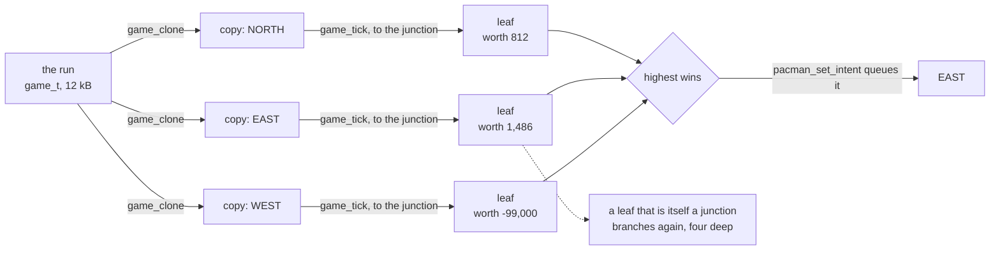
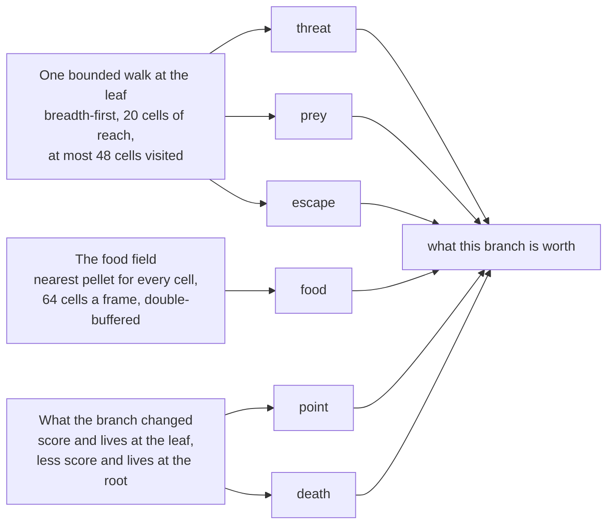

# How Pac-Man Thinks

[← Back to Index](PrePlanning/Index.md) · The long version, dead ends included:
[M6 §15–§18](Design/M6-Pacman-AI.md#15-the-look-ahead-player-the-game-as-its-own-forward-model) ·
Code: `Firmware/App/pacman_lookahead/`

Pac-Man decides where to go by **playing the game forward**. On every cell he enters, the firmware
copies the running game, drives the copy down each way out until it reaches the next junction, scores
the position it ends in, and takes the way that scored highest.

The forward model is `game_tick` — the same function that advances the real game. Every figure on this
page was measured on the board or on the host on **2026-08-19**, when the weights were refitted for
**levels cleared** rather than for score.

> This is the readable version. [M6 §15–§18](Design/M6-Pacman-AI.md) is the record: the measurements,
> the things that were tried and did not work, and why each number is the number it is.

---

## 1 The game is its own forward model

A search that plans ahead needs to know what happens next. Here that knowledge is the game itself:
`game_clone` takes a copy of the run, and `game_tick` advances the copy exactly as it advances what the
player sees.

So the ghosts inside a simulated future are the real ghosts, chasing with their real targeting rule.
The timers are the real timers. A life lost in the copy comes out of the same collision test as a life
lost on the panel. There is one set of rules in the firmware, and both the play and the planning run on
it.

**Two properties the copy has to guarantee, and neither was free:**

- **It is a real clone, not a `memcpy`.** The game's message bus holds pointers back into the game, so
  `game_clone` rebuilds them to point at the copy. Without that, a pellet eaten in a simulated future
  raises the real player's score with nothing on screen to show why.
- **It never draws.** Ghost timings are jittered from the microcontroller's hardware random generator,
  and there is exactly one of those. A clone drawing from it would move the real game's future every
  time Pac-Man thought, so `game_freeze_timings` takes the clone off it. A unit test counts a clone's
  draws and requires zero.

## 2 One decision, one cell

A decision belongs to a cell, not to a frame. Pac-Man enters a cell, the search asks *which way from
here*, and that answer stands until he enters the next one. Inside a corridor there is nothing to
decide, so each branch runs on until it reaches a **junction** — and that is where it is scored.



The -99,000 branch is one where Pac-Man dies: the weight on a lost life is **100,170**, so no score a
branch can gather buys a life back.

**It deepens one junction at a time.** The search widens before it goes deep: every branch one junction
out, then every branch two, then three. When the budget runs out mid-round, the round in progress is
thrown away and the last complete one is the answer — so a decision taken under pressure is shallower,
never lopsided. Depth-first at a tight budget was measured and is worse than walking in a straight
line: it spends everything on the first branch it tries.

On the board **2.9 to 3.7 of the 4 junctions** are reached, varying from run to run because the ghosts'
timings are jittered.

## 3 A decision is thought across ten frames

A frame is 16 ms and about 13 of those are free. One simulated cell costs **250 µs** — seven
`game_tick` calls carrying Pac-Man, four ghosts, the timers and the bus — so a single frame buys roughly
50 cells, and a decision wants far more than that.

It gets them from the clock the game already runs on: at arcade speed a cell lasts **10.6 frames**. The
recursion is an explicit stack, so the search can be put down between any two branches and picked up in
the next frame.

```
enters the cell                                                enters the next cell
      |                                                                |
      |  [250] [250] [250] [250] [250] [250] [250] [250] [250] [250]   |
      |   f1    f2    f3    f4    f5    f6    f7    f8    f9    f10    |
      |                                                                |
      +------------- ten 16 ms frames: how long a cell lasts ----------+

  pacman_lookahead_restart   on entering the cell — the stack starts over
  pacman_lookahead_think     one 250-tick slice a frame
  pacman_lookahead_get_direction   read every frame

  About 2,800 simulated ticks across the cell, against the 250 one frame would buy.
```

**Spreading the work costs no freshness.** The answer only takes effect when Pac-Man leaves the cell —
`pacman_set_intent` queues it — so a decision was always rooted at the cell's first frame and always
took effect at its last. A test requires that slices of 1, 7, 64 and 350 ticks all reach the answer one
uninterrupted pass reaches.

**The budget counts ticks, not cells,** because ticks are what cost time: a branch that walks into a
wall spends ticks and reaches no cell at all. Counting cells left that waste unmeasured, and a search
keeping to 48 cells still took 19 ms of a 13 ms allowance.

**A branch notices at once when Pac-Man cannot move.** A branch sets one direction and lets it ride, so
a bend can strand him. `pacman_is_stuck` is the test for that, written as the *negation of*
`pacman_advance` so the two cannot drift apart. Before it existed, **17.8 % of every simulated tick**
went into waiting out a 32-tick backstop; adding it was worth 25 % more score over a hundred draws.

## 4 What a position is worth

Every branch ends in a number: six terms, each with a weight. All six are written so that **more is
better** — distances enter as *nearness*, horizon minus distance — which keeps any one of them from
running away with the sum.

```
worth =   points          × point
        - lives_lost      × death
        + ghost_distance  × threat
        + (20 - prey_distance) × prey
        + (64 - food_distance) × food
        + ways_out        × escape
```

**Every distance is a maze distance.** A ghost behind a wall is as far away as the walk around it, and a
cell that looks open is only worth something if there is a way out of it. That is what separates a
player who walks into a dead end from one who does not.



Three of the six fall out of **one** walk at the leaf — one walk, three answers. Two are differences
against the root, which is what makes them mean *what this branch got me* rather than *how the run is
going*.

**A\* is the wrong tool here** and was rejected for a reason worth keeping: it answers one-to-one, this
is forty-five leaves against four ghosts, and on a unit-cost grid it degenerates to breadth-first with a
heap bolted on.

**The food field reaches where the leaf walk cannot.** The walk sees 20 cells out and visits at most 48.
Late in a level the last few pellets are further away than that, and `food` is what still points at
them: a breadth-first distance to the nearest pellet, held for *every* cell of the maze. A field that
size does not fit in one frame, so it is built the way a decision is — 64 cells a slice,
double-buffered, rebuilt only when the pellet count changes. The horizon is 64 cells; beyond that the
term flattens out.

## 5 The weights were fitted for levels cleared

Six numbers set how the player behaves. `Training/fit_lookahead.py` searches them with a (1+λ) evolution
strategy, scoring each candidate by **playing complete games** on fixed seeds — and the loop it drives
is the shipped one, so what gets fitted is what runs on the board.

What it is scored *on* changed on 2026-08-19. The question is no longer how many points a run gathers
but **how many levels it clears**, so a candidate is ranked by levels with points only breaking a tie.
The two are not the same thing: a caught ghost is worth 3,000 points and no progress at all, and ghosts
were 36 % of the score.

| weight | what it prices | value | before the refit |
|---|---|---|---|
| `death` | a life lost on this branch | **100,170** | 44,033 |
| `prey` | nearness to a ghost that can be eaten | **97** | 68 |
| `threat` | distance from the nearest ghost that cannot | **22** | 17 |
| `point` | a point of score gained | **4** | 8 |
| `food` | nearness to the next pellet | **5** | 3 |
| `escape` | ways out of the cell the branch ends in | **5** | 2 |

> **Read down that column and you have the player's character: it hunts, and it is afraid.** A ghost
> worth eating pulls harder than the pellets on the way to it, and a life is priced above anything a
> branch could gather. That matches the game's own arithmetic — clearing four ghosts in one frightened
> window is 3,000 points against 2,440 for a whole level of pellets.

### Fitting for levels made it hunt harder, not less

The obvious guess was the opposite. A caught ghost pays points and moves the player no closer to
clearing the level, so the first experiment turned hunting off — and measured **fewer** levels. Asked
for levels, the fit moved `prey` from 68 to 97 and `death` from 44,033 to 100,170 while cutting `point`
from 8 to 4: the player that clears levels **hunts harder, fears death more, and has stopped playing for
single pellets**. What costs levels is dying, not the time spent hunting.

### Two things the fit settled

- **`death` is a switch, not a dial.** Every value from 8,000 to 100,170 produces byte-identical runs —
  same levels, same deaths, same endings. It dominates every comparison it enters, so it only has to be
  *large*; a future search can spend its effort elsewhere.
- **`threat` is why Pac-Man sometimes stands still, and that is how he survives.** Cutting it from 22 to
  8 nearly removes the standing still and costs a third of the levels, because he then dies in 19 runs
  out of 20 instead of 12. Keeping his distance is what keeps him alive.

### How a number gets to be trusted

Three fits in a row produced weights that were excellent on their own draws and worse than untouched on
unseen ones — they stall on mazes they have not seen. So a candidate is now scored on **two disjoint
seed sets and ranked by the worse of them**. It costs exactly twice the simulation per candidate, and it
is what made a result transfer: selection reported 5.35 levels where the held-back seeds gave **5.50**.
It understates rather than flatters.

A third seed set, `1000..1019`, is in neither and stays reserved, so every figure in the next section is
measured on draws nothing was fitted *or selected* on.

## 6 What it costs, and what it scores

| measure | value | where it comes from |
|---|---|---|
| Depth reached | 2.9–3.7 of 4 junctions | `ott lookahead_cost` |
| Cost of a slice | 7.3 ms mean, **11 ms worst** | of the 13 ms a frame has spare — `ott lookahead_cost` |
| Ticks per decision | ≈ 2,800 over 10 frames | simulated game time |
| Cost of a simulated cell | 250 µs | seven `game_tick` calls |
| Memory | 4 × 12 kB, plus 12 kB in SRAM4 | one level of depth is a whole `game_t` |
| **Levels cleared** | **5.50** — 27,835 points | seeds 1000..1019, never fitted or selected against |
| The same, before the refit | 4.00 — 20,659 points | the weights this replaces, same seeds, same harness |

**Memory is what caps the depth, not time.** One level of depth is a 12 kB `game_t`; four of them plus
the frame buffer put main RAM at 94.0 %. The root copy lives in **SRAM4**, the separate 16 kB bank,
which is exactly big enough for one clone.

Both score rows are means over twenty complete games. A run ends when a level is not cleared in time, or
when Pac-Man goes 2,000 ticks without scoring anything at all — the second rule is what stops a
candidate that only survives from playing forever. An earlier harness capped every run at 30,000 ticks
instead, which allowed 5.4 levels and was already ending 7 runs in 20: **the measurement was capping the
very thing being measured.**

**The gain is real but it is not uniform.** Across four independent seed sets the refit averages **4.70
levels against 3.67** — three sets gain about a level and a half and one gains nothing at all. Absolute
levels vary far more between seed sets than between the two weightings: **mazes differ in difficulty
more than players do.**

## 7 How it behaves at the edges

Three things worth knowing before reading a run off the panel.

**Ties are settled by compass order.** A branch has to beat the incumbent outright, and branches are
tried `NORTH, SOUTH, EAST, WEST`. When two ways out are worth the same, north takes it — whichever way
Pac-Man was heading, including back where he came from. That is what you are seeing when he steps back
and forth at a junction. Breaking ties by carrying straight on was measured and scores better; it is
deliberately not built, because it changes *what* the player decides rather than how much it may think.

**It plans against timings that will move.** The real game jitters every ghost timing — house dot
counts, scatter and chase phases, the frightened window — by up to two seconds. A clone has those
frozen, so the future it plans against is the nominal one and the game then shifts it.

**Sometimes he just stands still.** In 8 of 20 host runs the refitted player stops making progress
rather than dying — it is the safest thing the evaluation can find, and on the host a rule ends the run.
**The game on the board has no such rule,** so there Pac-Man simply waits. It is the price of the
`threat` weight that keeps him alive, and lowering it costs a third of the levels.

## 8 Where this lives in the tree

| what | where |
|---|---|
| The search, its stack, the evaluation, the food field | `Firmware/App/pacman_lookahead/` |
| The forward model and the clone | `Firmware/App/game/` — `game_tick`, `game_clone`, `game_freeze_timings` |
| Whether a step is possible, and its negation | `Firmware/App/pacman/` — `pacman_advance`, `pacman_is_stuck` |
| The weight fit | `Firmware/Training/fit_lookahead.{c,py}` |
| What it costs on the board | `ott lookahead_cost`, `ott search_budget` |
| The long version, measurements and dead ends included | [Design/M6-Pacman-AI.md §15–§18](Design/M6-Pacman-AI.md) |
| What was decided and when | [PrePlanning/11-Decisions-and-As-Built.md](PrePlanning/11-Decisions-and-As-Built.md) — DEC-050..060 |
