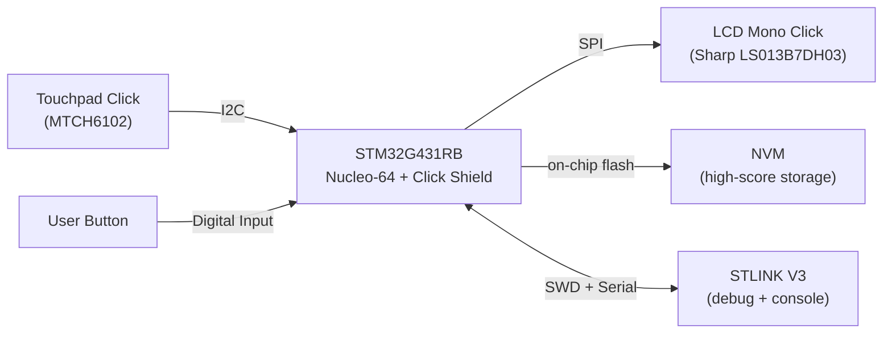
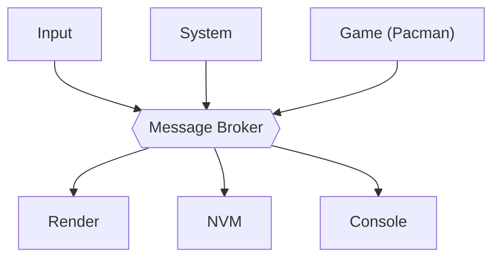

# 1 System Overview & System Context

[← Back to Index](Index.md)

## 1.1 Purpose

MicroPacControllerMan is a standalone embedded Pacman game. A player controls Pacman via a capacitive touchpad; the game state is rendered on a monochrome display. The system boots into a loading screen, then a menu showing the persisted high score, and starts a new game when the on-board user button is pressed.

Beyond delivering a playable game, the primary motivation for this project is to explore the capabilities and boundaries of AI-assisted software development: how far an AI coding agent can carry an embedded project like this — from requirements through firmware — and where its limits are.

## 1.2 System Boundary

**In scope:**
- Firmware running on the STM32G431RB Nucleo-64 board.
- Rendering to the LCD Mono Click (monochrome, 128×128).
- Reading directional input from the Touchpad Click.
- Reading the Nucleo user button (game start).
- Persisting a single high-score value in non-volatile memory (NVM).
- Core Pacman gameplay: a single fixed maze, pellets and power pellets, four distinct ghosts, a frightened mode, tunnel wrap-around, and a level-clear win condition (see [FR-010..FR-021](02-Requirements.md)).
- A host-computer build of the game logic (Model + Control) with an SDL-based View, for development and unit testing purposes ([Milestone 3.4](04-Implementation-Phases-and-Milestones.md)).

**Out of scope (for now):**
- Multiple lives, bonus fruit / bonus items, additional levels or mazes beyond the first playable maze, sound, multiplayer, wireless connectivity, multiple high-score entries.

## 1.3 External Interfaces

| Interface | Direction | Description |
|---|---|---|
| Touchpad Click (MTCH6102, I2C) | Input | Directional gestures / touch position, translated into up/down/left/right movement intent. |
| Nucleo user button | Input | Starts a new game from the menu screen. |
| LCD Mono Click (Sharp LS013B7DH03, SPI) | Output | Renders loading screen, menu, and live game state. |
| NVM (on-chip flash or equivalent) | Output/Input | Persists the single high-score entry across power cycles. |
| STLINK V3 (on-board) | Output | Debugging (SWD) and serial console (log output) during development. |

## 1.4 Context Diagrams

Two views: the physical hardware and the top-level software structure. Design choices such as the RTOS are intentionally left out here — see [03 Architecture](03-Architecture.md).

### 1.4.1 Hardware Block Diagram

Blocks are physical components; each arrow is labelled with the electrical interface.

### 1.4.2 Software Block Diagram

Blocks are the top-level software modules; they communicate only through the message broker (never directly). See [03 Architecture §3.2](03-Architecture.md#32-message-broker) for detail.

