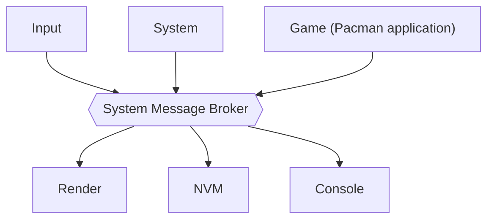
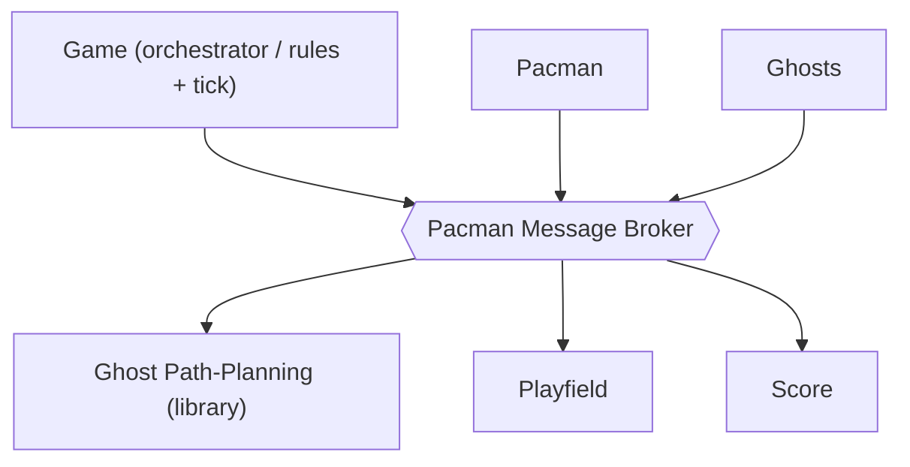
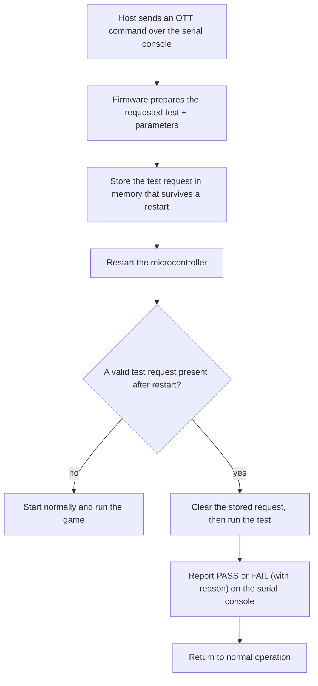

# 3 Architecture

[← Back to Index](Index.md) · See also [02 Requirements](02-Requirements.md)

This document describes *how* the firmware is structured, at a functional-specification level — enough to start implementation, without prescribing code-level detail. Requirement IDs from [02 Requirements](02-Requirements.md) are referenced inline.

## 3.1 MVP Architecture (Model / View / Control)

The game is built as Model-View-Control (FR-101), so the game logic is identical on host and target and is unit-testable without hardware (NFR-101):

- **Model** — owns the entire game state: maze layout, Pacman position/direction, ghost positions/modes, frightened timer, score, lives, and an in-memory copy of the high score. Pure data plus small accessor functions; no I/O.
- **View** — takes a read-only snapshot of the Model and renders it, behind one interface with two implementations: the target draws to the LCD Mono Click; the host draws to an SDL window (CON-103 / FR-104).
- **Control** — the game rules: given the current Model and an input event (or a tick), it produces the next Model state. Stateless (FR-102), so it is trivially unit-testable (NFR-101) and identical on host and target.

> **Decided (R-008):** the maze is a **reduced, display-fit maze** — a custom layout smaller than the classic 28×31 grid, sized so tiles, Pacman, four ghosts and pellets stay legible on 128×128. Exact dimensions are set during Pacman Development (FR-022). See [R-008](05-Risks-Assumptions-and-Dependencies.md#51-risks).

## 3.2 Message Broker

All inter-module communication goes through a custom message broker (no external library, no runtime heap — NFR-103). The design is adapted from [MovyDesk_Prototype/lib/MessageBroker](https://github.com/MaxLell/MovyDesk_Prototype/tree/main/lib/MessageBroker), with two deliberate changes: modules register an **output queue** instead of a callback, and the broker is an **object** (its state is passed in explicitly), so several independent instances can coexist.

Design rules:

- **Object-oriented / instance state (self pointer).** Every broker API call takes the broker instance as its first argument (`self`); all of the broker's state lives inside that instance. Nothing is global, so multiple brokers run side by side without interfering. This project uses **two instances** (FR-110):
  - a **system broker** connecting the firmware-level modules (§3.2.2);
  - a **Pacman broker** used only inside the game (§3.6).
- **Content-agnostic.** The broker only reads a message's topic ID for routing; it treats the payload as opaque bytes and never interprets it.
- **Fixed-size messages, copied by value.** A message is a topic ID plus a small fixed-size payload, moved by value so no module holds a pointer into another's memory (NFR-103). The one exception is the render frame: its message carries a *handle* to a statically-allocated, double-buffered read-only snapshot (§3.6, R-007) rather than the bulk data — still no heap.
- **One input queue per broker.** Publishers hand a message to the broker via its API; the broker owns the input queue.
- **One output queue per subscriber.** A module registers its output queue for the topics it cares about; the broker copies each message into every subscribed module's output queue.
- **A dedicated worker moves the messages (FR-108).** One task per broker drains the input queue and fans each message out to the subscribed output queues; this is the only place messages cross between modules.
- **Backpressure (NFR-105).** A publisher can ask the broker how much room is left in the input queue; a publish onto a full queue returns a status instead of blocking the publisher.
- **Slow-consumer isolation.** If a subscriber's output queue is full, that message is dropped for that subscriber (and counted) rather than stalling the broker or other subscribers.
- **Host parity.** The same API runs on the host without an RTOS, so the game and any bus user build and run unmodified on both platforms (FR-104).

### 3.2.1 Broker interface (shape)

The instance (`self`) is the first argument of every call:

```c
typedef struct message_broker message_broker_t;   /* an instance ("self")  */
typedef struct mb_subscriber  mb_subscriber_t;     /* a module's output queue */

mb_status_e mb_init     (message_broker_t *self, /* queue sizing ... */);
mb_status_e mb_start    (message_broker_t *self);              /* start the worker (FR-108) */
mb_status_e mb_subscribe(message_broker_t *self, mb_subscriber_t *sub, msg_id_e topic);
mb_status_e mb_publish  (message_broker_t *self, const msg_t *msg);          /* into input queue */
bool        mb_input_has_space(message_broker_t *self, u16 headroom);        /* backpressure (NFR-105) */
mb_status_e mb_receive  (mb_subscriber_t *sub, msg_t *out_msg);              /* a module reads its own queue */
```

The two instances are created the same way, e.g. a `g_system_broker` and a Pacman-internal broker owned by the Game module (§3.6).

### 3.2.2 Software Modules on the System Broker (sandwich view)

The system broker sits in the middle; the firmware **software modules** sit above and below it (a "sandwich"). A module never calls another module directly (FR-103) — it only publishes to the broker and receives on its own output queue. These are *software modules*, not tasks; how modules map onto FreeRTOS tasks is a separate concern (§3.4).



| Module | Responsibility |
|---|---|
| **Input** | Reads the touchpad and the user button; turns them into direction and button messages. |
| **System** | Orchestrates the screen flow: loading → menu → game → game over → menu. |
| **Game** | Runs the Pacman application (§3.6); bridges the game to the rest of the firmware. |
| **Render** | Draws the current screen to the display — the single rendering output (§3.6). |
| **NVM** | Loads the high score at start-up and stores it back only when it changes (NFR-004). |
| **Console** | Serves the serial CLI: log output and OTT test commands (§3.7). |

## 3.3 Message Definitions

Every topic is a value in one compile-time `enum msg_id_e`; the payload is a small fixed-size struct. A module handles each received message to completion before taking the next (§3.5).

| Topic (`msg_id_e`) | Payload | Published by | Consumed by | Handling |
|---|---|---|---|---|
| `MSG_INPUT_DIRECTION` | `{ direction: N/S/E/W }` | Input | Game | Set Pacman's next intended direction. |
| `MSG_INPUT_BUTTON` | `{ event: pressed }` | Input | System | Start a game from the menu (FR-003); confirm button-confirmed OTT tests. |
| `MSG_SYSTEM_SHOW_LOADING` | *(none)* | System | Render | Show the loading screen (FR-001). |
| `MSG_SYSTEM_SHOW_MENU` | `{ high_score }` | System | Render | Show the menu with the current high score (FR-002). |
| `MSG_SYSTEM_START_GAME` | *(none)* | System | Game | Start a new game (FR-003, FR-006). |
| `MSG_RENDER_FRAME` | `{ frame handle }` | Game | Render | Draw the latest game frame (FR-005). Frame-transfer mechanics: see [R-007](05-Risks-Assumptions-and-Dependencies.md#51-risks). |
| `MSG_GAME_SCORE_UPDATED` | `{ score }` | Game | NVM | Track the running score for the end-of-game high-score check. |
| `MSG_GAME_OVER` | `{ final_score, won }` | Game | System, NVM | End the game (FR-007 / FR-021); trigger the high-score check (FR-008). |
| `MSG_HIGHSCORE_LOADED` | `{ high_score }` | NVM | System | Provide the stored high score at start-up for the menu (FR-002, FR-009). |

> **Frame transfer (decided, R-007):** `MSG_RENDER_FRAME` carries a version + handle to a double-buffered, read-only game snapshot. The Game module owns two statically-allocated snapshot buffers and swaps them each tick; Render draws the last-published one. This keeps the queue tiny and uses no heap (NFR-103). See [R-007](05-Risks-Assumptions-and-Dependencies.md#51-risks).

## 3.4 FreeRTOS Task Breakdown

A *task* is a unit of execution; a *module* (§3.2.2) is a unit of code. They are usually 1:1, but several modules may share a task. This project runs the following tasks (FR-105); the message broker runs in its own task (FR-108).

| Task | Runs module(s) | Responsibility |
|---|---|---|
| **Message Broker Task** | (broker worker) | Drains the broker input queue and fans messages out to subscribers (FR-108). Owns no application state. |
| **Input Task** | Input | Reads the touchpad (I2C) and user button; debounces and classifies. |
| **System Task** | System | Drives the screen-flow state machine. |
| **Game Task** | Game (+ the Pacman application and its internal broker, §3.6) | Runs the game tick and game rules. |
| **Render Task** | Render | Draws the current screen to the display. |
| **NVM Task** | NVM | Loads/stores the high score (NFR-004). |
| **Console Task** | Console | Serial CLI: logging and OTT commands (FR-106 / FR-107). |

On the host build these responsibilities run as plain functions/loops driven by the SDL event loop instead of tasks — see [Milestone 3 (Pacman Development)](04-Implementation-Phases-and-Milestones.md).

## 3.5 Generic Software Module Template (Active Object)

Every module follows the **Active Object** pattern (FR-109), per Miro Samek ([state-machine.com/active-object](https://www.state-machine.com/active-object)): a module bundles its private data, its own thread of control, a single inbound message queue (its only external input), and a small state machine that reacts to messages.

The pattern's rules:

- **No shared data** — a module's state is private and only touched from its own task, so there are no data races and no application-level locks.
- **Asynchronous messaging only** — modules interact solely by publishing messages; a publisher never waits for a consumer.
- **Run-to-completion** — a module fully handles one message before taking the next, so handlers are ordinary sequential code.
- **No blocking in handlers** — the only place a module waits is on its (empty) input queue; anything else that would block is modelled as a later message (a timer expiry, a done-notification, a reply).

In shape, every module exposes only an `init` (create its queue, subscribe to its topics, start its task) and is otherwise reached only by sending it a message. The task body is always the same loop: wait for a message, dispatch it to the state machine, repeat. This boilerplate is factored into a reusable base each module builds on.

## 3.6 Pacman Sub-Application Architecture

The Pacman application runs in the **Game Task** and uses its **own broker instance** — the Pacman broker (FR-110) — separate from the system broker. Only the **Game** module bridges the two: it injects inputs (`MSG_INPUT_DIRECTION`, `MSG_SYSTEM_START_GAME`) inward and forwards results (`MSG_RENDER_FRAME`, `MSG_GAME_SCORE_UPDATED`, `MSG_GAME_OVER`) outward. This keeps game-internal traffic off the system bus and lets the whole application run unchanged on the host (FR-104).

The same sandwich applies one level down — the Pacman broker in the middle, the game modules above and below:



**Module set** (each built on the Active-Object template, §3.5):

| Module | Responsibility |
|---|---|
| **Game (orchestrator)** | Advances the game tick; runs collision checks (Pacman vs. ghost → caught, or → eaten while frightened); applies power-pellet → frightened mode and its timeout; decides game-over (FR-007) and level-clear (FR-021); assembles the render frame. |
| **Pacman** | The player character: consumes the current direction intent and moves Pacman along the playfield, eating pellets. |
| **Ghosts** | The four ghosts: their positions and current mode (chase / scatter / frightened + timer). |
| **Ghost Path-Planning** | A stateless *library* that, given a ghost, Pacman, and the playfield, returns the ghost's next step — the four distinct behaviors (FR-014) and scatter/chase (FR-015). |
| **Playfield** | The maze: walls, pellets, power pellets, tunnels; answers "is this cell walkable", removes eaten pellets (FR-011/FR-017), detects an empty maze (FR-021). |
| **Score** | The running score and the scoring rules (pellet / power-pellet / ghost-eaten values, A-006). |
| **Agent (base)** | The shared base for movable entities: a position, a facing direction, and a step/move policy that respects the playfield (walls FR-010, tunnel wrap FR-012). **Pacman and each Ghost *are* Agents** and specialize it — Pacman follows the input direction, Ghosts follow Ghost Path-Planning. |

**Rendering interface (your question — how the frame gets out):** each tick, the **Game** orchestrator assembles a **render frame** — a compact description of what to draw (Pacman, the four ghosts, remaining pellets, score, current mode) — and publishes it. The Game module forwards it onto the system broker as `MSG_RENDER_FRAME` (§3.3), where the firmware **Render** module draws it to the display. The frame is the single rendering output, delivered as a version + handle to a double-buffered read-only snapshot (decided, [R-007](05-Risks-Assumptions-and-Dependencies.md#51-risks)).

## 3.7 On-Target Test (OTT) CLI Framework

Each testable capability is exposed as its own command on the serial console: a **setup** step validates the command's arguments, and a **run** step performs the action and checks the result. On failure the reason is printed to the console, so **no debugger is needed to read the outcome** (FR-107), and an external Python harness can drive the automatable tests (NFR-104).

Some tests need the hardware to start from a clean, known state, so a test request is preserved across a controlled **restart of the microcontroller** and executed on the next start-up. High-level flow:



Two things make this robust: the stored request carries an integrity check, so an ordinary power-on is never mistaken for a test request; and the result is reported **before** returning to normal operation, not after. The detailed mechanism — exactly how the request survives a restart, and the verification of this sequence against the reference firmware — is documented separately in [09 OTT Mechanism & Reset Flow](09-OTT-Mechanism-and-Reset-Flow.md).

Tests whose outcome a human must confirm (e.g. "is the pattern visible on the display?") are still commands, but are **button-confirmed**: the firmware shows the expected result and waits for the user button, failing on timeout. See [06 Verification & Validation](06-Verification-and-Validation.md) for which tests are Automatic vs. Manual.
