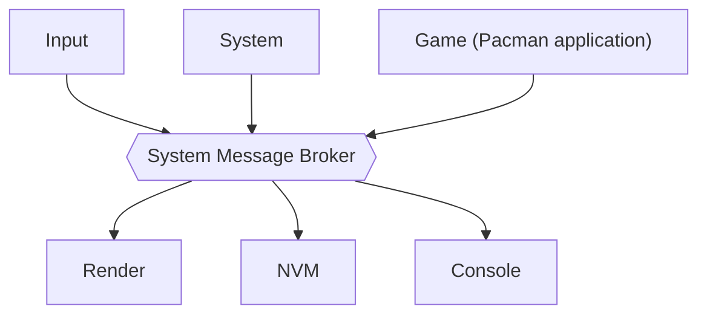
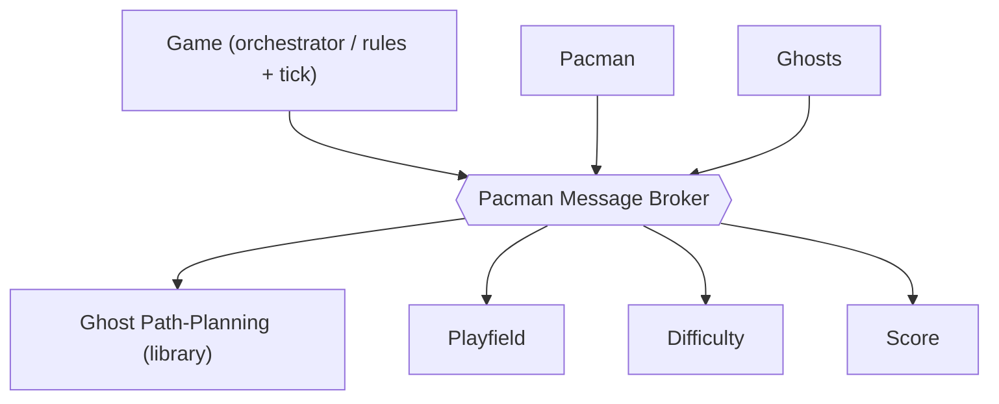
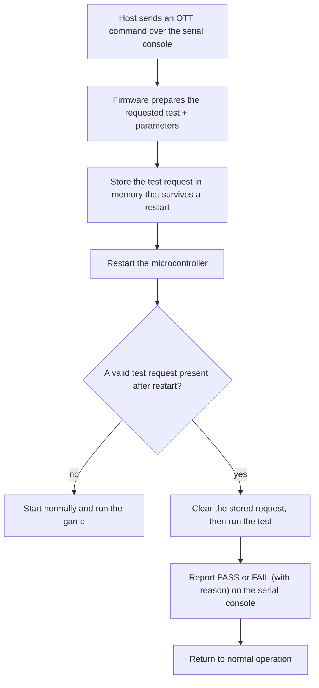

# 3 Architecture

[← Back to Index](Index.md) · See also [02 Requirements](02-Requirements.md)

This document describes *how* the firmware is structured, at a functional-specification level — enough to start implementation, without prescribing code-level detail. Requirement IDs from [02 Requirements](02-Requirements.md) are referenced inline.

## 3.1 MVP Architecture (Model / View / Control)

The game is built as Model-View-Control (FR-101), so the game logic is identical on host and target and is unit-testable without hardware (NFR-101):

- **Model** — owns the entire game state: the active maze, Pacman position/direction, ghost positions/modes, frightened timer, score, lives, current level (1–5), and an in-memory copy of the high score. Pure data plus small accessor functions; no I/O.
- **View** — turns a copy of the Model into what should be on screen, and draws it. Split in two: **Game-View** is pure logic (cell-to-pixel, interpolation between simulation steps, sprite and HUD layout, and the maze's *appearance* map — see [10 §10.2](10-Pacman-Game-Design.md)) and is unit-tested on the host; **Render** is the platform port behind one interface, drawing to the shield's ST7789V panel on the target and to an SDL window on the host (CON-103 / FR-104).
- **Control** — the game rules: given the current Model and an input event (or a tick), it produces the next Model state. Stateless (FR-102), so it is trivially unit-testable (NFR-101) and identical on host and target.

> **Decided (R-008):** the maze is a **reduced, display-fit maze** — a custom layout smaller than the classic 28×31 grid, sized so tiles, Pacman, four ghosts and pellets stay legible on 128×128. Exact dimensions are set during Pacman Development (FR-022). See [R-008](05-Risks-Assumptions-and-Dependencies.md#51-risks).

## 3.2 Message Broker

All inter-module communication goes through a custom message broker (no external library, no runtime heap — NFR-103). The design is adapted from [MovyDesk_Prototype/lib/MessageBroker](https://github.com/MaxLell/MovyDesk_Prototype/tree/main/lib/MessageBroker), with two deliberate changes: modules register an **output queue** instead of a callback, and the broker is an **object** (its state is passed in explicitly), so several independent instances can coexist.

Design rules:

- **Object-oriented / instance state (self pointer).** Every broker API call takes the broker instance as its first argument (`self`); all of the broker's state lives inside that instance. Nothing is global, so multiple brokers run side by side without interfering. This project uses **two instances** (FR-110):
  - a **system broker** connecting the firmware-level modules (§3.2.2);
  - a **Pacman broker** used only inside the game (§3.6).
- **Content-agnostic.** The broker only reads a message's topic ID for routing; it treats the payload as opaque bytes and never interprets it.
- **Fixed-size messages, copied by value — with no exceptions.** A message is a topic ID plus a small fixed-size payload, moved by value so no module ever holds a pointer into another's memory (NFR-103). The render frame used to be the one exception; it is not any more, because the game state turned out to be 56 bytes and the large thing — the image — never travels (§3.3).
- **One input queue per broker.** Publishers hand a message to the broker via its API; the broker owns the input queue.
- **One output queue per subscriber.** A module registers its output queue for the topics it cares about; the broker copies each message into every subscribed module's output queue.
- **A dedicated worker moves the messages (FR-108).** One task per broker drains the input queue and fans each message out to the subscribed output queues; this is the only place messages cross between modules.
- **Backpressure (NFR-105).** A publisher can ask the broker how much room is left in the input queue; a publish onto a full queue returns a status instead of blocking the publisher.
- **Slow-consumer isolation.** If a subscriber's output queue is full, that message is dropped for that subscriber (and counted) rather than stalling the broker or other subscribers.
- **Host parity.** The same API runs on the host without an RTOS, so the game and any bus user build and run unmodified on both platforms (FR-104).

### 3.2.1 Broker interface (shape)

The instance (`self`) is the first argument of every call:

```c
typedef struct message_broker message_broker_t;   /* an instance ("self")  */
typedef struct mb_subscriber  mb_subscriber_t;     /* a module's output queue */

mb_status_e mb_init     (message_broker_t *self, /* queue sizing ... */);
mb_status_e mb_start    (message_broker_t *self);              /* start the worker (FR-108) */
mb_status_e mb_subscribe(message_broker_t *self, mb_subscriber_t *sub, msg_id_e topic);
mb_status_e mb_publish  (message_broker_t *self, const msg_t *msg);          /* into input queue */
bool        mb_input_has_space(message_broker_t *self, u16 headroom);        /* backpressure (NFR-105) */
mb_status_e mb_receive  (mb_subscriber_t *sub, msg_t *out_msg);              /* a module reads its own queue */
```

The two instances are created the same way, e.g. a `g_system_broker` and a Pacman-internal broker owned by the Game module (§3.6).

### 3.2.2 Software Modules on the System Broker (sandwich view)

The system broker sits in the middle; the firmware **software modules** sit above and below it (a "sandwich"). A module never calls another module directly (FR-103) — it only publishes to the broker and receives on its own output queue. These are *software modules*, not tasks; how modules map onto FreeRTOS tasks is a separate concern (§3.4).



| Module | Responsibility |
|---|---|
| **Input** | Reads the joystick and the user button; turns them into direction and button messages. |
| **System** | Orchestrates the screen flow: loading → menu → game (levels 1–5) → score (2 s, FR-023) → menu. |
| **Game** | Runs the Pacman application (§3.6); bridges the game to the rest of the firmware. |
| **Render** | Draws the current screen to the display — the single rendering output (§3.6). |
| **NVM** | Loads the high score at start-up and stores it back only when it changes (NFR-004). |
| **Console** | Serves the serial CLI: log output and OTT test commands (§3.7). |

## 3.3 Message Definitions

Every topic is a value in one compile-time `enum msg_id_e`; the payload is a small fixed-size struct. A module handles each received message to completion before taking the next (§3.5).

| Topic (`msg_id_e`) | Payload | Published by | Consumed by | Handling |
|---|---|---|---|---|
| `MSG_INPUT_DIRECTION` | `{ direction: N/S/E/W }` | Input | Game | Set Pacman's next intended direction. |
| `MSG_INPUT_BUTTON` | `{ event: pressed }` | Input | System | Start a game from the menu (FR-003); confirm button-confirmed OTT tests. |
| `MSG_SYSTEM_SHOW_LOADING` | *(none)* | System | Render | Show the loading screen (FR-001). |
| `MSG_SYSTEM_SHOW_MENU` | `{ high_score }` | System | Render | Show the menu with the current high score (FR-002). |
| `MSG_SYSTEM_START_GAME` | *(none)* | System | Game | Start a new game (FR-003, FR-006). |
| `MSG_GAME_STATE` | `{ actors, pellets, score, lives, level }` | Game | Game-View | One coherent state per simulation step (§10.1), copied by value like everything else. |
| `MSG_DISPLAY_LIST` | `{ items: pixel position + what to draw }` | Game-View | Render | What must be on screen *now*, in pixels. Render works out what changed. |
| `MSG_GAME_SCORE_UPDATED` | `{ score }` | Game | NVM | Track the running score for the end-of-game high-score check. |
| `MSG_GAME_OVER` | `{ final_score, won }` | Game | System, NVM | End the game (FR-007 / FR-021); show the score screen for 2 s (FR-023); trigger the high-score check (FR-008). |
| `MSG_HIGHSCORE_LOADED` | `{ high_score }` | NVM | System | Provide the stored high score at start-up for the menu (FR-002, FR-009). |

> **No message carries a pointer.** An earlier design had `MSG_RENDER_FRAME` hand Render a
> handle to a double-buffered snapshot, as the one sanctioned exception to copy-by-value
> ([R-007](05-Risks-Assumptions-and-Dependencies.md#51-risks)). That exception is
> **withdrawn**, because the premise behind it was wrong: what is large is the *rendered
> image*, not the game state. The 28 × 31 maze is two 868-bit pellet maps, five actors and a
> handful of counters — **246 bytes**, measured, which copies like any other payload. The image
> is 153,600 bytes and never needs to travel at all, because Render draws it. The margin is
> three orders of magnitude, not four as it was at 11 × 9, and still not close.
>
> Three things fall out. There is no pointer in any message, so no module can hold a
> reference into another's memory. There is no second frame buffer to find room for — one is
> 60 % of SRAM and two do not fit. And because every payload is a copy, a Render task running
> concurrently with Game can never observe a half-updated model; the concurrency safety is a
> by-product rather than something to arrange.

## 3.4 FreeRTOS Task Breakdown

A *task* is a unit of execution; a *module* (§3.2.2) is a unit of code. They are usually 1:1, but several modules may share a task. This project runs the following tasks (FR-105); the message broker runs in its own task (FR-108).

| Task | Runs module(s) | Responsibility |
|---|---|---|
| **Message Broker Task** | (broker worker) | Drains the broker input queue and fans messages out to subscribers (FR-108). Owns no application state. |
| **Input Task** | Input | Reads the joystick and user button (GPIO); debounces and classifies. |
| **System Task** | System | Drives the screen-flow state machine. |
| **Game Task** | Game (+ the Pacman application and its internal broker, §3.6) | Runs the game tick and game rules. |
| **Render Task** | Render | Draws the current screen to the display. |
| **NVM Task** | NVM | Loads/stores the high score (NFR-004). |
| **Console Task** | Console | Serial CLI: logging and OTT commands (FR-106 / FR-107). |

On the host build these responsibilities run as plain functions/loops driven by the SDL event loop instead of tasks — see [Milestone 3 (Pacman Development)](04-Implementation-Phases-and-Milestones.md).

## 3.5 Generic Software Module Template (Active Object)

Every module follows the **Active Object** pattern (FR-109), per Miro Samek ([state-machine.com/active-object](https://www.state-machine.com/active-object)): a module bundles its private data, its own thread of control, a single inbound message queue (its only external input), and a small state machine that reacts to messages.

The pattern's rules:

- **No shared data** — a module's state is private and only touched from its own task, so there are no data races and no application-level locks.
- **Asynchronous messaging only** — modules interact solely by publishing messages; a publisher never waits for a consumer.
- **Run-to-completion** — a module fully handles one message before taking the next, so handlers are ordinary sequential code.
- **No blocking in handlers** — the only place a module waits is on its (empty) input queue; anything else that would block is modelled as a later message (a timer expiry, a done-notification, a reply).

In shape, every module exposes only an `init` (create its queue, subscribe to its topics, start its task) and is otherwise reached only by sending it a message. The task body is always the same loop: wait for a message, dispatch it to the state machine, repeat. This boilerplate is factored into a reusable base each module builds on.

## 3.6 Pacman Sub-Application Architecture

The Pacman application runs in the **Game Task** and uses its **own broker instance** — the Pacman broker (FR-110) — separate from the system broker. Only the **Game** module bridges the two: it injects inputs (`MSG_INPUT_DIRECTION`, `MSG_SYSTEM_START_GAME`) inward and forwards results (`MSG_GAME_STATE`, `MSG_GAME_SCORE_UPDATED`, `MSG_GAME_OVER`) outward. This keeps game-internal traffic off the system bus and lets the whole application run unchanged on the host (FR-104).

The same sandwich applies one level down — the Pacman broker in the middle, the game modules above and below:



**Module set** (each built on the Active-Object template, §3.5):

| Module | Responsibility |
|---|---|
| **Game (orchestrator)** | Advances the game tick; runs collision checks (Pacman vs. ghost → caught, or → eaten while frightened); applies power-pellet → frightened mode and its timeout; decides game-over (FR-007) and level-clear (FR-021); publishes one coherent state per step. |
| **Pacman** | The player character: consumes the current direction intent and moves Pacman along the playfield, eating pellets. |
| **Ghosts** | The four ghosts: their positions and current mode (chase / scatter / frightened + timer). |
| **Ghost Path-Planning** | A stateless *library* that, given a ghost, Pacman, and the playfield, returns the ghost's next step — the four distinct behaviors (FR-014) and scatter/chase (FR-015). |
| **Playfield** | The maze: walls, pellets, power pellets, tunnel; answers "is this cell walkable" and "is this cell tunnel", removes eaten pellets (FR-011/FR-017), detects an empty maze (FR-021). There is one maze and every level plays it ([10 §10.2](10-Pacman-Game-Design.md)). |
| **Difficulty** | A stateless lookup from level number to how that level plays (FR-026, [10 §10.9](10-Pacman-Game-Design.md)): every speed, the frightened window and its warning, the scatter/chase plan, and the pellet counts at which Blinky accelerates. It is the whole of the game's progression in one table, separate so that table can be reviewed against the source it was transcribed from. |
| **Score** | The running score and the scoring rules (pellet / power-pellet / ghost-eaten values, A-006). |
| **Agent (base)** | The shared base for movable entities: a position, a facing direction, and a step/move policy that respects the playfield (walls FR-010, tunnel wrap FR-012). **Pacman and each Ghost *are* Agents** and specialize it — Pacman follows the input direction, Ghosts follow Ghost Path-Planning. |

**Rendering interface — how a moved Pacman reaches the panel.** Three modules and two messages, each doing one thing:

1. **Game** publishes `MSG_GAME_STATE` once per simulation step (§10.1): the five actors with their cells, directions, modes and *progress towards the next cell*, plus the two pellet bitmaps, score, lives and level. 246 bytes, copied — most of it the two 868-cell pellet maps of the 28 × 31 maze.
2. **Game-View** holds the last state and runs at the **frame rate, not the step rate** — that is the point of it. Between two steps it draws the same actors nine times at advancing interpolated positions (§10.1), and publishes `MSG_DISPLAY_LIST`: what should be on screen *now*, in pixels.
3. **Render** draws it, and is the only module that works out **what changed** since the last frame. It knows what it drew and it is the only one that knows the cost: two 16 x 16 rectangles are 2.08 ms, a full frame is 252 ms ([M2 Board Bring-Up §3](../Design/M2-Board-Bring-Up.md)). Nobody else should be making that trade.

The seam between 2 and 3 is the same one the rest of the firmware uses: everything above it is pure logic, host-tested without mocks; everything below it is a platform port with a target and a host implementation.

**Game-Session — the one frame everybody runs.** Those three steps in that order, paced by a `Services/sw_timer`, are `game_session`. It exists because three callers need the identical frame — the target's `app_main`, the host application, and the `pacman` on-target test — and the frame has two traps that are not visible from outside: the pacing timer is one-shot and its callback has to re-arm it (forget it and exactly one frame runs, which shows a maze and then nothing), and a level change hands the whole field over across several display lists rather than one. A copy per caller would have to rediscover both, and the on-target test would then be exercising the copy instead of the firmware.

What it deliberately does not own is **input and reporting**: the three callers read a joystick, a keyboard, and a joystick plus a confirm button, and say different things about what they see. The session takes a direction, answers questions about the run, and leaves the talking to whoever is running it.

## 3.7 On-Target Test (OTT) CLI Framework

Each testable capability is exposed as its own command on the serial console: a **setup** step validates the command's arguments, and a **run** step performs the action and checks the result. On failure the reason is printed to the console, so **no debugger is needed to read the outcome** (FR-107), and an external Python harness can drive the automatable tests (NFR-104). The console CLI itself is provided by the vendored [EmbeddedCli](https://github.com/MaxLell/EmbeddedCli) framework ([D-007](05-Risks-Assumptions-and-Dependencies.md#53-dependencies)).

Some tests need the hardware to start from a clean, known state, so a test request is preserved across a controlled **restart of the microcontroller** and executed on the next start-up. High-level flow:



Two things make this robust: the stored request carries an integrity check, so an ordinary power-on is never mistaken for a test request; and the result is reported **before** returning to normal operation, not after. The detailed mechanism — exactly how the request survives a restart, and the verification of this sequence against the reference firmware — is documented separately in [09 OTT Mechanism & Reset Flow](09-OTT-Mechanism-and-Reset-Flow.md).

Tests whose outcome a human must confirm (e.g. "is the pattern visible on the display?") are still commands, but are **button-confirmed**: the firmware shows the expected result and waits for the user button, failing on timeout. See [06 Verification & Validation](06-Verification-and-Validation.md) for which tests are Automatic vs. Manual.

## 3.8 Build & Toolchain

One source tree builds three ways and shares the platform-independent Model / Control / game code and the message broker:

- **Target firmware** — compiled with **arm-none-eabi-gcc**, orchestrated by **CMake** (which also carries the cross-toolchain setup, so no separate toolchain file). Pin, peripheral and clock initialisation is **generated by STM32CubeMX** and built against the **STM32 HAL** ([DEC-012](11-Decisions-and-As-Built.md), which superseded M1's register-level CMSIS approach in [DEC-001](11-Decisions-and-As-Built.md)); the BSP wraps the HAL and the application, message broker and game are written on top. The clock tree is part of what CubeMX owns: **SYSCLK 170 MHz** from the PLL, with a 1 kHz SysTick time base — see [M2 Board Bring-Up §2](../Design/M2-Board-Bring-Up.md). FreeRTOS (CON-104) is a target-state constraint, introduced during **M4 System Integration** ([DEC-002](11-Decisions-and-As-Built.md)); until then a bare super-loop runs.
- **Host build** — the same Model / Control / broker code compiled with the host compiler via **CMake**, with **SDL** providing the View (CON-103 / FR-104).
- **Unit tests** — run under **Ceedling / Unity** (CON-102 / NFR-101), exercising Model / Control / broker with no hardware and no FreeRTOS.

The host/target split behind Input, Display, NVM and timing is realised as small platform ports. Their exact interfaces are defined during Board Bring-Up / Pacman Development, not here.

## 3.9 Firmware Source Tree Layout

The `Firmware/` tree follows the **layered layout of the reference project** ([BareMetalHollowClockFw](https://github.com/MaxLell/BareMetalHollowClockFw)): the code is split into architecture layers, and within a layer every module lives in its **own folder** named after the module, holding its `<module>.c` and `<module>.h`. Each layer carries a `Readme.md` stating its purpose and dependency rule. This is the required structure for the project — new code is placed by layer, not dumped into a flat `src/`.

**Dependency direction (top may use below; never the reverse):** `App` → `Drivers` → `Services` → `Bsp` → STM32 HAL/CMSIS.

| Layer (folder) | Purpose | What to create here |
|---|---|---|
| `App/` | Application layer: entry point and the game itself. | `App/app_main.c` (entry, called from the CubeMX-generated `main()`: init the platform, run a pending OTT, print the banner, start the app); one folder per application module (`App/<module>/`). The Pacman Model/View/Control modules land here (Milestone 3). |
| `Bsp/` | Board Support Package: access to the STM32U545 and board through the STM32 HAL, thin C API upward. No application logic. | One folder per peripheral/facility (`Bsp/<module>/`). Peripheral wrappers carry the **`_bsp` suffix**, as in the reference project: `dio_bsp/` (digital I/O — the *only* module that may call HAL GPIO), `uart_bsp/` (USART1 VCP), `spi_bsp/`, `systick_bsp/` (1 kHz tick + 1 ms hook). Non-peripheral facilities keep a plain name: `switch/` (debounced-input primitive), `user_button/` (its B1/PC13 instance), `joystick/` (the shield's five keys, likewise instances of `switch`), `retain_ram/` (`.noinit` buffer for the OTT reset, doc 09). |
| `Drivers/` | Device drivers built on `Bsp/` transports (device-oriented API). Never call the HAL directly. | One folder per device (`Drivers/<device>/`): `st7789/` (the display controller over `spi_bsp` + `dio_bsp`), `display/` (the port above it, which is what the game sees) — added in Milestone 2. Note that `gfx/` and `framebuffer/` are **not** here: they touch no hardware and live in `Services/`. |
| `Services/` | Hardware-independent, reusable, host-testable middleware. | One folder per service (`Services/<service>/`): `delay/` (the one blocking wait), `sw_timer/` (all non-blocking timeouts and periodic work); later the pub-sub message broker (§3.2), the Active-Object base (§3.5), FSM helpers. |
| `Test/` | Verification code (mirrors the reference `Test/` layout). | `Test/Target/` — OTT core (`ott.c`, `ott_scenarios.c`); `Test/Target/scripts/` — one module per OTT scenario (`ott_<name>.c/.h`, e.g. `ott_user_button`); `Test/run_ott.py` — host harness; `Test/Host/` — Ceedling/Unity host unit tests (from Milestone 3); `Test/support/` — vendored Unity. |
| `ThirdParty/` | Vendored third-party and ST-provided code — **not our code**, kept out of the architecture layers. | One folder per dependency: `EmbeddedCli/` (the CLI framework); `STM32_U545RE_HAL/` — the STM32CubeMX export, self-contained: its own `Core/` (generated `main.c` + peripheral init), `Drivers/` (HAL + CMSIS), startup file and linker script, and a `cmake/stm32cubemx` interface library. HAL/CMSIS/startup/linker are device-specific and therefore live here, not in `Bsp/`. The `.noinit` block in the linker script is ours and must be re-added after every regeneration. |

Two module-naming rules follow from the table. First, a **generic primitive and its concrete instance are separate modules** (`switch` vs. `user_button`), so the primitive stays reusable. Second, **exactly one module owns each hardware access path** — all GPIO goes through `dio_bsp` by logical pin name, and all timing through `delay`/`sw_timer`; there is deliberately no `millis()`-style tick accessor above `Bsp/`.

Build files stay at the `Firmware/` root: `CMakeLists.txt` (which also carries the cross-toolchain setup above its `project()` call, so no separate toolchain file or `cmake/` folder is needed), `openocd.cfg`, and `.clang-format`. Because headers are included by bare name, `CMakeLists.txt` lists each module folder on the include path, grouped by layer.

**Adding a module:** create `<Layer>/<module>/<module>.c`/`.h`, add the `.c` to the `add_executable` list and the folder to `target_include_directories` in `CMakeLists.txt`. **Adding an OTT test:** create `Test/Target/scripts/ott_<name>.c`/`.h` and add one row to `Test/Target/ott_scenarios.c` — no change to the OTT core or CLI.
