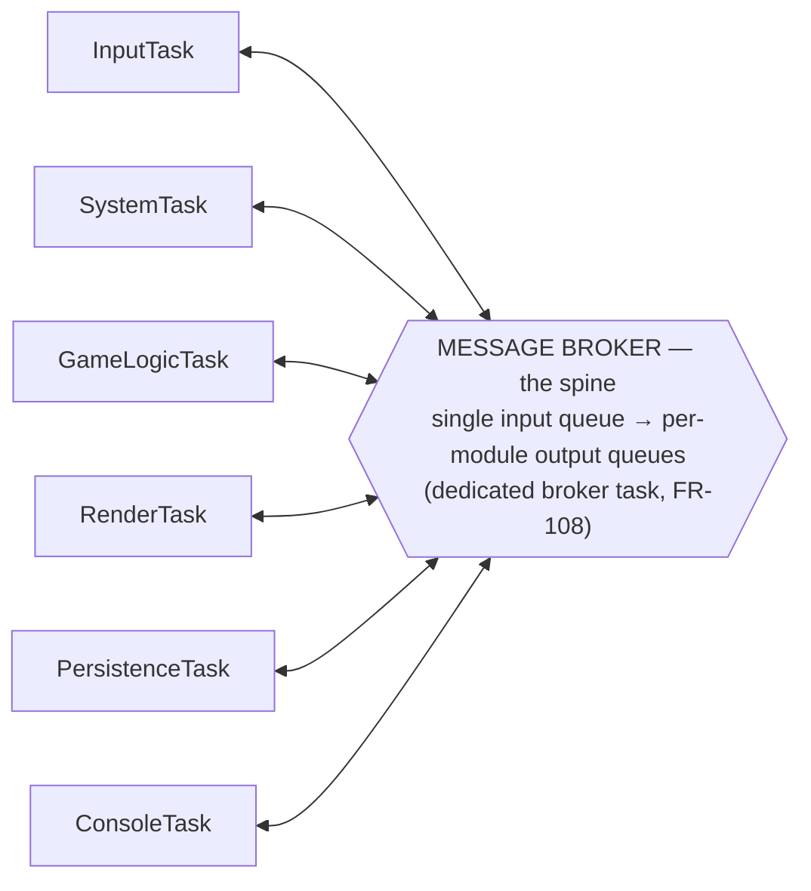
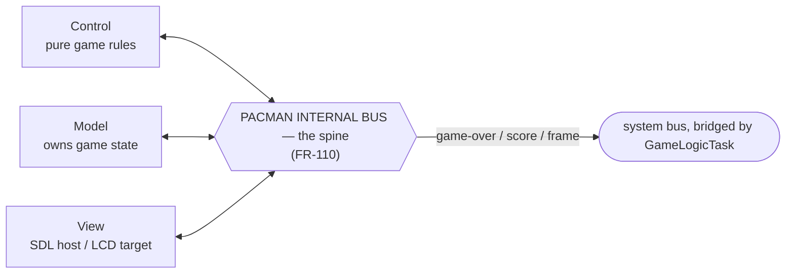
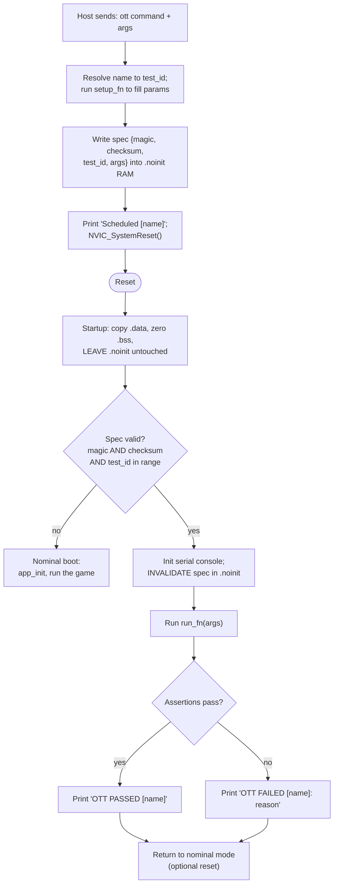

# 3 Architecture

[← Back to Index](Index.md) · See also [02 Requirements](02-Requirements.md)

This document describes *how* the firmware is structured. The behaviour it must deliver is specified in [02 Requirements](02-Requirements.md); relevant requirement IDs are referenced inline.

## 3.1 MVP Architecture (Model / View / Control)

The game is built as Model-View-Control (FR-101), so the game logic is identical on host and target and is unit-testable without hardware (NFR-101):

- **Model** — owns the entire game state: maze layout, Pacman position/direction, ghost positions/modes, frightened timer, score, lives, and an in-memory copy of the high score. Pure data plus small accessor functions; no I/O.
- **View** — takes a read-only snapshot of the Model and renders it, behind one interface with two implementations:
  - Target: draws to the LCD Mono Click over SPI.
  - Host: draws to an SDL window (CON-103 / FR-104).
- **Control** — the game rules: given the current Model and an input event (or a tick), it produces the next Model state. Implemented as pure, stateless functions (FR-102) so it is trivially unit-testable (NFR-101) and identical on host and target.

## 3.2 Message Broker (System Message Bus)

All inter-module communication goes through a custom message broker (no external library, no runtime heap — NFR-103). The design is adapted from [MovyDesk_Prototype/lib/MessageBroker](https://github.com/MaxLell/MovyDesk_Prototype/tree/main/lib/MessageBroker), with one deliberate change: **modules register an output queue instead of a callback**. This decouples publishers from subscribers in both time and thread of execution and keeps delivery off the publisher's stack.

Design rules:

- **Fixed-size messages, copied by value.** A message is a self-contained value type — a topic ID plus a small fixed-size payload (a union of per-topic structs). The broker moves whole message objects through FreeRTOS queues and never dereferences or owns external payload pointers (NFR-103).
- **One shared input queue.** Every publisher writes into the broker's single input queue via the broker API.
- **One output queue per module.** Each module owns an output queue and subscribes it to the topics it cares about. An init-time subscription table maps each topic → the set of subscribed output queues. This table is the only place the broker inspects `msg_id`; it is otherwise agnostic to message content.
- **A dedicated broker task does the fan-out (FR-108).** One FreeRTOS task blocks on the input queue and, for each message, copies it into every subscribed output queue.
- **Backpressure (NFR-105).** A publisher can query the input queue's free capacity before publishing; a publish on a full queue returns a status (bounded, non-blocking) instead of blocking the publisher indefinitely.
- **Output-queue-full policy.** During fan-out the broker uses a non-blocking send with a per-subscriber drop policy (a full output queue is counted/logged and the message dropped for that subscriber) so that one slow consumer cannot stall the broker task.
- **Host parity.** On the host build the same API is backed by an in-process queue/dispatch loop (no FreeRTOS dependency), so Model/Control and any bus user compile and run unmodified on both platforms (FR-104).

### 3.2.1 Broker API (sketch)

```c
#define MB_MAX_PAYLOAD_BYTES  32U   /* sized to the largest payload in §3.3 */

typedef struct {
    msg_id_e msg_id;                        /* topic / routing key             */
    u16      data_size;                      /* valid bytes in payload          */
    u8       payload[MB_MAX_PAYLOAD_BYTES];  /* inline, no external pointers    */
} msg_t;

typedef struct mb_subscriber* mb_subscriber_t;   /* opaque; wraps a queue      */

typedef enum { MB_OK = 0, MB_ERR_FULL, MB_ERR_TIMEOUT,
               MB_ERR_INVALID_ARG, MB_ERR_NO_SPACE, MB_ERR_NOT_INIT } mb_status_e;

/* lifecycle + the dedicated broker task (FR-108) */
mb_status_e messagebroker_init(u16 input_queue_length);
mb_status_e messagebroker_start(u16 task_stack_words, u16 task_priority);

/* subscription: a module registers its output queue against topics */
mb_status_e messagebroker_create_subscriber(u16 out_queue_length, mb_subscriber_t* out);
mb_status_e messagebroker_subscribe(mb_subscriber_t sub, msg_id_e topic);
mb_status_e messagebroker_receive(mb_subscriber_t sub, msg_t* out_msg, u32 timeout_ticks);

/* publishing into the shared input queue */
mb_status_e messagebroker_publish(const msg_t* msg, u32 timeout_ticks);

/* backpressure (NFR-105) */
u16  messagebroker_input_free_slots(void);
bool messagebroker_input_has_space(u16 headroom);
```

### 3.2.2 Fishbone View — Modules on the Bus

The broker is the **spine**; each module is a **bone** that hangs off it. A module never talks to another module directly (FR-103) — it only publishes into the broker's input queue and receives on its own output queue.



## 3.3 Message Definitions

Every topic is a value in a single compile-time `enum msg_id_e`. Payloads are fixed-size structs carried inline in `msg_t` (§3.2.1). A module handles each received message to completion inside its own task (run-to-completion, see §3.5).

| Topic (`msg_id_e`) | Payload | Published by | Consumed by | Handling |
|---|---|---|---|---|
| `MSG_INPUT_DIRECTION` | `{ direction: N/S/E/W }` | InputTask | GameLogicTask | Sets Pacman's next intended direction. |
| `MSG_INPUT_BUTTON` | `{ event: pressed }` | InputTask | SystemTask | Starts a game from the menu (FR-003); confirms button-confirmed OTT tests. |
| `MSG_SYSTEM_SHOW_LOADING` | *(none)* | SystemTask | RenderTask | Render the loading screen (FR-001). |
| `MSG_SYSTEM_SHOW_MENU` | `{ high_score: u32 }` | SystemTask | RenderTask | Render the menu with the current high score (FR-002). |
| `MSG_SYSTEM_START_GAME` | *(none)* | SystemTask | GameLogicTask | Initialize a new Model and begin play (FR-003, FR-006). |
| `MSG_GAME_STATE_CHANGED` | `{ snapshot: game_state_t }` | GameLogicTask | RenderTask | Render the latest game frame (FR-005). |
| `MSG_GAME_SCORE_UPDATED` | `{ score: u32 }` | GameLogicTask | PersistenceTask | Track the running score for the end-of-game high-score check. |
| `MSG_GAME_OVER` | `{ final_score: u32, won: bool }` | GameLogicTask | SystemTask, PersistenceTask | End the game (FR-007 / FR-021); trigger high-score evaluation (FR-008). |
| `MSG_PERSISTENCE_HIGHSCORE_LOADED` | `{ high_score: u32 }` | PersistenceTask | SystemTask | Provide the NVM high score at boot for the menu (FR-002, FR-009). |

## 3.4 FreeRTOS Task Breakdown

Each module is one FreeRTOS task with one inbound queue (the active-object rule, §3.5 / FR-109). The `MessageBrokerTask` is the only task that touches more than one module's queues (FR-108).

| Task | Responsibility | Subscribes to | Publishes |
|---|---|---|---|
| `MessageBrokerTask` | The broker fan-out worker (FR-108): drains the input queue and copies each message into every subscribed output queue. Owns no application state. | *(the broker input queue)* | *(all subscriber output queues)* |
| `InputTask` | Polls/reacts to Touchpad Click (I2C) and the user button (GPIO/EXTI); debounces and classifies gestures. | — | `MSG_INPUT_DIRECTION`, `MSG_INPUT_BUTTON` |
| `SystemTask` | Orchestrates boot sequence and screen state (loading → menu → game → game over → menu). | `MSG_INPUT_BUTTON`, `MSG_GAME_OVER`, `MSG_PERSISTENCE_HIGHSCORE_LOADED` | `MSG_SYSTEM_SHOW_LOADING`, `MSG_SYSTEM_SHOW_MENU`, `MSG_SYSTEM_START_GAME` |
| `GameLogicTask` | Owns the Model; runs Control on each tick and on input events. Hosts the Pacman internal bus (§3.6 / FR-110). | `MSG_INPUT_DIRECTION`, `MSG_SYSTEM_START_GAME` | `MSG_GAME_STATE_CHANGED`, `MSG_GAME_OVER`, `MSG_GAME_SCORE_UPDATED` |
| `RenderTask` | Draws the current screen (loading/menu/game) to the LCD Mono Click via the View. | `MSG_SYSTEM_SHOW_LOADING`, `MSG_SYSTEM_SHOW_MENU`, `MSG_GAME_STATE_CHANGED` | — |
| `PersistenceTask` | Reads the high score from NVM at boot; writes it back only when it changes (NFR-004 / NFR-103). | `MSG_GAME_SCORE_UPDATED`, `MSG_GAME_OVER` | `MSG_PERSISTENCE_HIGHSCORE_LOADED` |
| `ConsoleTask` | Serves the serial-console CLI: general log output plus OTT on-target test commands (FR-106 / FR-107). | — | *(varies — an OTT command may publish/inject any topic to drive the test it is checking)* |

On the host build these same responsibilities run as plain functions/loops driven by the SDL event loop instead of FreeRTOS tasks — see [Milestone 3 (Pacman Development)](04-Implementation-Phases-and-Milestones.md).

## 3.5 Generic Software Module Template (Active Object)

Every module follows the **Active Object** pattern (FR-109), as described by Miro Samek ([state-machine.com/active-object](https://www.state-machine.com/active-object)). An active object bundles four things behind one facade: private data, its own thread of control (one FreeRTOS task), a single inbound event/message queue (its only external input), and a state machine that processes messages.

Rules the pattern enforces:

- **No shared data.** A module's state is private to its `.c` file and only ever touched from its own task — so there are no data races and no application-level mutexes.
- **Asynchronous messaging only.** Modules interact solely by publishing messages (§3.2); a publisher never blocks waiting for a consumer.
- **Run-to-completion (RTC).** A module processes exactly one message fully before taking the next, so handlers are ordinary single-threaded code.
- **No blocking in handlers.** The only place a module blocks is its task waiting on its (empty) queue. Anything that would otherwise block is modelled as a future message (timer expiry, DMA-done, a reply topic).

FreeRTOS mapping: one `xTaskCreate` + one `xQueueCreate` per module; the task body blocks on `xQueueReceive`, then dispatches.

```c
/* --- ao_module.h : the only things the outside world sees --- */
typedef struct AoModule AoModule;          /* private definition lives in the .c */
void AoModule_init(AoModule *me);          /* create queue + task, subscribe to topics */

/* --- ao_module.c --- */
typedef enum { ST_IDLE, ST_ACTIVE } ModuleState;

struct AoModule {
    TaskHandle_t    task;      /* this AO's thread of control      */
    mb_subscriber_t sub;       /* this AO's output queue (§3.2)    */
    ModuleState     state;     /* current-state variable           */
    /* ...private data owned exclusively by this task...           */
};

static void AoModule_task(void *arg)
{
    AoModule *me = (AoModule *)arg;
    msg_t m;
    for (;;) {                                     /* block ONLY here             */
        if (messagebroker_receive(me->sub, &m, portMAX_DELAY) == MB_OK) {
            AoModule_dispatch(me, &m);             /* run-to-completion; no block  */
        }
    }
}

static void AoModule_dispatch(AoModule *me, const msg_t *m)
{
    switch (me->state) {
        case ST_IDLE:   /* switch on m->msg_id, update private data, publish outputs */ break;
        case ST_ACTIVE: /* ... */ break;
    }
}
```

The boilerplate (create queue, task loop, subscribe) can be factored into a tiny reusable base that each concrete module embeds as its first member, so a module only writes its own state enum, private data, and `dispatch()`.

## 3.6 Pacman Sub-Application Architecture

The Pacman application (Model/View/Control) runs inside `GameLogicTask` and uses its **own internal message-bus instance** (FR-110), separate from the system bus in §3.2. This keeps game-internal traffic (input → Control → Model → View-snapshot) off the system bus, and lets the whole application run unchanged on the host, where the internal bus is the in-process variant (FR-104).

The same fishbone shape applies one level down: the Pacman internal broker is the spine; Model, View and Control are the bones.



Only `GameLogicTask` bridges the two buses: it forwards the outward-facing results (`MSG_GAME_STATE_CHANGED`, `MSG_GAME_SCORE_UPDATED`, `MSG_GAME_OVER`) onto the system bus and injects `MSG_INPUT_DIRECTION` / `MSG_SYSTEM_START_GAME` inward.

## 3.7 On-Target Test (OTT) CLI Framework

FR-106 / FR-107 follow the OTT pattern from the project owner's [BareMetalHollowClockFw](https://github.com/MaxLell/BareMetalHollowClockFw) (`Test/Target/ott.c`), adapted from that project's SEGGER RTT transport to this project's **STLINK V3 serial console**, and with two corrections applied after verifying the mechanism (see §3.7.2).

Each testable capability gets its own OTT command, `ott <name> <args...>`, implemented as a `<name>_setup()` (argument parsing/validation) and a `<name>_run()` (performs the action and asserts the outcome internally). Because some tests must survive a reset with the peripheral in a known state, the command to run is persisted across a software reset in **retained (`.noinit`) RAM**.

### 3.7.1 Flow



### 3.7.2 Verification notes (corrections vs. the naive flow)

The mechanism and the proposed reset sequence were verified against the reference firmware and the Cortex-M reset model — the full analysis (SRAM retention across a software reset, the `.noinit` `NOLOAD` linker section, startup handling, and the point-by-point check of the 7-step flow) is in [09 OTT Mechanism & Reset Flow](09-OTT-Mechanism-and-Reset-Flow.md). Two corrections are baked into the flow above:

- **Integrity guard (required).** After a cold/power-on boot, `.noinit` RAM holds garbage. Deciding "run a test" from the `test_id` range alone (as the reference does) can misfire, so this project stores a **magic word + checksum** with the spec and runs a test only if magic *and* checksum *and* range all check out. The spec is **invalidated before the test runs**, so a crash mid-test cannot loop-boot into the same test.
- **Report over serial, before any reset.** The reference reports only via a debugger breakpoint on failure (success is silent). This project instead prints `OTT PASSED [name]` / `OTT FAILED [name]: reason` **over the STLINK serial console from within the run step** (FR-107), so the Python harness (NFR-104) can parse it with no debugger attached. The post-test reset is optional and only returns the board to nominal mode; it does **not** produce the report.

### 3.7.3 Manual vs. automatic tests

Tests whose pass/fail cannot be determined by firmware alone (e.g. "does the display visibly show X") are still exposed as OTT commands but require a human to confirm — see [06 Verification & Validation](06-Verification-and-Validation.md) for which tests are **Manual, button-confirmed** (display the expected result, then wait for the user button, failing on timeout) versus **Automatic**. An external Python script drives the Automatic subset sequentially over the serial console and collects PASS/FAIL results (NFR-104). Building that script is scoped to [Board Bring-Up](04-Implementation-Phases-and-Milestones.md); it is out of scope for Pre-Planning.
