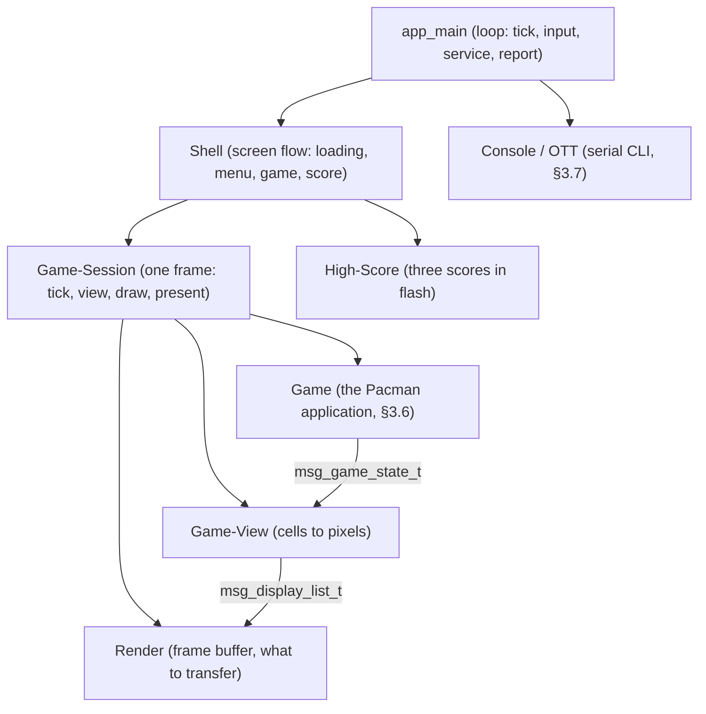
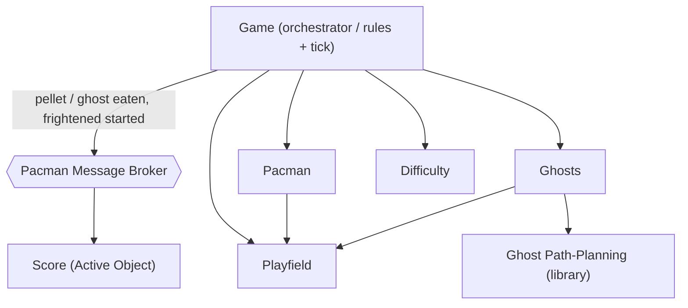
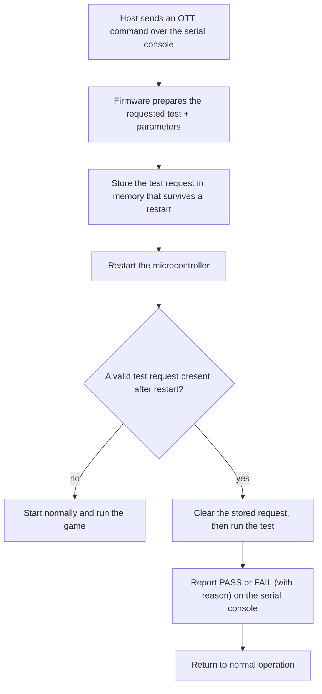

# 3 Architecture

[← Back to Index](Index.md) · See also [02 Requirements](02-Requirements.md)

This document describes *how* the firmware is structured, at a functional-specification level — enough to start implementation, without prescribing code-level detail. Requirement IDs from [02 Requirements](02-Requirements.md) are referenced inline.

## 3.1 MVP Architecture (Model / View / Control)

The game is built as Model-View-Control (FR-101), so the game logic is identical on host and target and is unit-testable without hardware (NFR-101):

- **Model** — owns the entire game state: the active maze, Pacman position/direction, ghost positions/modes, frightened timer, score, lives, current level (1–21), and an in-memory copy of the high score. Pure data plus small accessor functions; no I/O.
- **View** — turns a copy of the Model into what should be on screen, and draws it. Split in two: **Game-View** is pure logic (cell-to-pixel, interpolation between simulation steps, sprite and HUD layout, and the maze's *appearance* map — see [10 §10.2](10-Pacman-Game-Design.md)) and is unit-tested on the host; **Render** is the platform port behind one interface, drawing to the shield's ST7789V panel on the target and to an SDL window on the host (CON-103 / FR-104).
- **Control** — the game rules: given the current Model and an input event (or a tick), it produces the next Model state. Stateless (FR-102), so it is trivially unit-testable (NFR-101) and identical on host and target.

> **Settled (R-008, superseded):** the reduced, display-fit maze was a consequence of the 128×128 panel. On the 240×320 shield the **arcade's own 28 × 31 grid at 8 px per cell** fits with room left for the HUD (FR-022), and it is what the firmware plays — transcribed rather than authored, one maze for every level ([DEC-019](11-Decisions-and-As-Built.md)).

## 3.2 Message Broker

The firmware carries a custom message broker (no external library, no runtime heap — NFR-103), adapted from [MovyDesk_Prototype/lib/MessageBroker](https://github.com/MaxLell/MovyDesk_Prototype/tree/main/lib/MessageBroker) with two deliberate changes: modules register an **output queue** instead of a callback, and the broker is an **object** (its state is passed in explicitly), so several independent instances can coexist.

**Where it is used, and where it is not.** There is **one broker instance** in the firmware today: the **Pacman broker** (FR-110), owned by the Game module and drained at the end of each tick (§3.6). It carries the game's *events* — a pellet eaten, a ghost eaten, frightened mode starting — to whoever reacts to them, and `Score` is the one module that does. Everywhere else a module reaches the next one by an ordinary call that hands over a **message type by value** (§3.3): `game` gives `game_view` a `msg_game_state_t`, `game_view` gives `render` a `msg_display_list_t`. What FR-103 asks for is that no module can see into another's memory, and copying the declared value across a direct call satisfies that as squarely as a queue does. A queue buys **decoupling in time** — the caller not knowing or waiting for who reacts — and that is worth its cost where something is *announced* to an unknown number of listeners, which is what the game's events are and what a frame hand-over is not. The system-level broker of the original design is therefore **not built**; §3.2.2 is what stands in its place. See [DEC-027](11-Decisions-and-As-Built.md).

Design rules:

- **Object-oriented / instance state (self pointer).** Every broker API call takes the broker instance as its first argument (`self`); all of the broker's state lives inside that instance. Nothing is global, so several brokers could run side by side without interfering — the mechanism is not limited to the one instance that exists.
- **Content-agnostic.** The broker only reads a message's topic ID for routing; it treats the payload as opaque bytes and never interprets it.
- **Fixed-size messages, copied by value — with no exceptions.** A message is a topic ID plus a small fixed-size payload, moved by value so no module ever holds a pointer into another's memory (NFR-103, FR-103). The render frame used to be the one exception; it is not any more, because the game state turned out to be 246 bytes and the large thing — the image — never travels (§3.3).
- **One input queue per broker.** Publishers hand a message to the broker via its API; the broker owns the input queue.
- **One output queue per subscriber.** A module registers its output queue for the topics it cares about; the broker copies each message into every subscribed module's output queue.
- **The owning loop delivers the messages (FR-108).** Delivery happens when the owner asks for it — `game` drains its broker at the end of a tick, so an event published while the rules are running reaches its subscriber after that tick and never mid-way through it. There is no thread of the broker's own.
- **Backpressure (NFR-105).** A publisher can ask the broker how much room is left in the input queue; a publish onto a full queue returns a status instead of blocking the publisher.
- **Slow-consumer isolation.** If a subscriber's output queue is full, that message is dropped for that subscriber (and counted) rather than stalling the broker or other subscribers.
- **Host parity.** The same code runs on the host, so the game and any bus user build and run unmodified on both platforms (FR-104).

### 3.2.1 Broker interface (shape)

The instance (`self`) is the first argument of every call — `Services/msg_broker`, as built:

```c
typedef struct msg_broker     msg_broker_t;       /* an instance ("self")    */
typedef struct msg_subscriber msg_subscriber_t;   /* a module's output queue */

void                msg_broker_init      (msg_broker_t *self, msg_t *buffer, uint16_t capacity);
void                msg_broker_start     (msg_broker_t *self);                       /* accept publishes */
void                msg_broker_subscribe (msg_broker_t *self, msg_subscriber_t *sub, msg_id_e topic);
msg_broker_status_e msg_broker_publish   (msg_broker_t *self, const msg_t *msg);      /* into input queue */
bool                msg_broker_has_input_space(const msg_broker_t *self, uint16_t headroom); /* NFR-105 */
uint32_t            msg_broker_process_all(msg_broker_t *self);                       /* deliver (FR-108) */
msg_broker_status_e msg_subscriber_receive(msg_subscriber_t *sub, msg_t *out_msg);    /* a module reads its own queue */
```

`msg_broker_process_all()` is the one call that delivers: it empties the input queue, copying each message to its subscribers. Its caller is the loop that owns the instance, which is what makes the moment of delivery explicit rather than a scheduling accident.

### 3.2.2 Firmware Structure (layered calls, message types by value)

The application is a stack of modules, each one reached by an ordinary call from the one above and handing down a declared value (§3.3). The arrows are calls; what travels on them is copied.



| Module | Responsibility |
|---|---|
| **app_main** | The loop (§3.4). Samples the joystick and the button once per frame and turns them into a direction and a start press for the Shell; polls the console; reports each screen, level and life change on the serial line. Owns no game state. |
| **Shell** | The screen flow: loading (NFR-005, NFR-001) → menu → game → score (2 s, FR-023) → menu (FR-001/002/003/023). Offers a finished run to the high-score table. Draws its two word screens as ordinary background display lists through Render. |
| **Game-Session** | The one frame all three callers run — target, host application and the `pacman` OTT: tick the game, hand the state to the view, hand each display list to Render, present. Paced by a self-re-arming `sw_timer`. |
| **Game** | The Pacman application (§3.6) and the owner of the internal broker. |
| **Game-View** | Cells become pixels: layout, interpolation, sprite and palette choice, the HUD's slots. |
| **Render** | The single frame buffer, save-under erasure, and the only module that decides **what to transfer** to the panel. |
| **High-Score** | The three best scores behind a magic word, a version and a CRC, in the flash page the linker reserves; written only when the table changes (FR-008/009, NFR-004). |
| **Console / OTT** | The serial CLI: the boot banner, the `ott`, `reset`, `highscore` and `start` commands, and each test's verdict (§3.7). |

## 3.3 Message Definitions

Every topic is a value in one compile-time `enum msg_id_e` and every payload is a small fixed-size struct, whether it travels on the broker or across a call. Both are in `Services/msg`, which is the one place the shape of anything crossing a module boundary is written down.

**Carried on the Pacman broker** (§3.6) — announcements with no named recipient, each handled to completion before the next (§3.5):

| Topic (`msg_id_e`) | Payload | Published by | Consumed by | Handling |
|---|---|---|---|---|
| `MSG_GAME_PELLET_EATEN` | `{ is_power_pellet }` | Game | Score | Add the pellet's value; a power pellet is worth more (§10.6). |
| `MSG_GAME_GHOST_EATEN` | *(none)* | Game | Score | Score the next value in the chain — 200, 400, 800, 1600. |
| `MSG_GAME_FRIGHTENED_STARTED` | *(none)* | Game | Score | Reset that chain, because each power pellet starts it again. |

**Handed over by value across a call** — a named recipient, so the queue would buy nothing (§3.2):

| Type | From | To | What it is |
|---|---|---|---|
| `msg_game_state_t` | Game | Game-View | One coherent state per simulation step (§10.1): five actors with their cells, facings and progress into the current cell, the two 868-bit pellet maps, score, lives, level, and which ghosts are frightened. **246 bytes**, copied. |
| `msg_display_list_t` | Game-View, Shell | Render | What must be on screen *now*, in pixels. Render works out what changed. The Shell's two word screens are the same kind of list, drawn as background items. |

What the Shell needs of a finished run and of the score table it asks for by accessor — `game_session_get_score()`, `high_score_get()` — because there is one caller and it wants an answer, not an announcement.

The remaining values in `msg_id_e` and their payload structs — the input, system and NVM topics of the original design, including `msg_high_score_t` and `msg_game_over_t` — are **declared but neither published nor handed over**: they were written for the system broker that §3.2.2 replaced. They stay as the vocabulary for anything that later does need announcing, and the unit tests use them as neutral topics.

> **No message carries a pointer.** An earlier design had `MSG_RENDER_FRAME` hand Render a
> handle to a double-buffered snapshot, as the one sanctioned exception to copy-by-value
> ([R-007](05-Risks-Assumptions-and-Dependencies.md#51-risks)). That exception is
> **withdrawn**, because the premise behind it was wrong: what is large is the *rendered
> image*, not the game state. The 28 × 31 maze is two 868-bit pellet maps, five actors and a
> handful of counters — **246 bytes**, measured, which copies like any other payload. The image
> is 153,600 bytes and never needs to travel at all, because Render draws it. The margin is
> three orders of magnitude, not four as it was at 11 × 9, and still not close.
>
> Three things fall out. There is no pointer in any message, so no module can hold a
> reference into another's memory. There is no second frame buffer to find room for — one is
> 60 % of SRAM and two do not fit. And because every payload is a copy, a Render task running
> concurrently with Game can never observe a half-updated model; the concurrency safety is a
> by-product rather than something to arrange.

## 3.4 Execution Model

**There is no RTOS.** The firmware runs one cooperative loop and a 1 kHz tick interrupt (FR-105, [DEC-027](11-Decisions-and-As-Built.md)). Two levels of execution, and that is all:

| Runs where | What runs there | Why there |
|---|---|---|
| **The 1 kHz tick** (`systick_bsp`, interrupt) | Debouncing the user button and the five joystick keys; sampling the UART receive register into the console's ring buffer. | All three need a *steady* sample rate. The loop's rate is not steady — a frame takes milliseconds — and the receive register holds one character with no FIFO, so a command line typed at the board would be shredded by a loop that was away drawing ([RF-016](../Refactoring-Backlog.md)). |
| **The loop** (`app_main`) | `ott_poll()`, `sw_timer_process()`, reading the debounced input, `shell_service()`, reporting changes on the console. | Everything that may take its time, in an order that repeats. Nothing here blocks: the frame is due or it is not, a command line is complete or it is not. |

The frame is not called by the loop directly — it is armed. A `Services/sw_timer` fires at the frame period and `game_session` runs one frame from that, then re-arms the timer. Which means the game's rate is set in one place and the loop stays free to answer the console between frames: a command arriving mid-frame is answered at the end of it, well inside a keystroke.

**What replaced the tasks.** The original design gave Input, System, Game, Render, NVM and Console a task each, and a seventh to the broker. Every one of those is now a module the loop calls in a fixed order (§3.2.2). Nothing was lost with the scheduler, because nothing in this firmware waits: there is no blocking I/O, no request to a device that answers later, and no work that must proceed while another part is stalled. The one thing a preemptive scheduler would buy — a slow module not delaying a fast one — is bought instead by the frame budget being measured: five actors cost 5.26 ms of 16.7 ms, and a level change is the only thing that ever came close.

The host build runs the same loop, module for module — `sw_timer_process()`, then `shell_service()` — over the host port of `systick_bsp`. Only the input differs: SDL keyboard events stand in for the tick's key sampling, which is exactly the seam FR-104 asks for.

## 3.5 Software Module Template (Active Object)

A module that reacts to *events* rather than to calls is built on the **Active Object** pattern, per Miro Samek ([state-machine.com/active-object](https://www.state-machine.com/active-object)): private data, one inbound message queue as its only external input, and a small handler that reacts to what arrives. `Services/active_object` is that base, and **`App/score` is the module built on it** — the one place in the game where something happens *because* something else happened, rather than because a caller wanted an answer.

The pattern's rules, as they apply without a scheduler:

- **No shared data** — a module's state is private and reached only through its own API, so there is nothing for two parts of the system to disagree about.
- **Asynchronous messaging** — the publisher hands its event to the broker and moves on; it does not know or wait for who reacts.
- **Run-to-completion** — a module fully handles one message before taking the next, so handlers are ordinary sequential code.
- **No blocking in handlers** — anything that would wait is modelled as a later message (a timer expiry, a done-notification, a reply).

What the pattern does **not** bring here is a thread. `active_object_process_all()` drains the module's inbox when its owner asks — for `score`, at the end of the game tick that published the events (§3.4). The rules that matter are the first and the third, and both hold in a cooperative loop; the fourth stops being a rule and becomes a fact, since a handler that blocked would stop the whole firmware, not just its own task.

Modules that answer a question — `playfield`, `difficulty`, `ghost_path`, `game_view`, `render` — are deliberately **not** Active Objects. Routing "is this cell walkable?" through a queue would make the movement code unwritable, and a reply that arrives later is not an answer.

## 3.6 Pacman Sub-Application Architecture

The Pacman application owns **the** broker instance — the Pacman broker (FR-110) — created, started and drained by the **Game** module: `msg_broker_process_all()` runs at the end of each tick, so an event published while the rules are mid-tick reaches `Score` once the tick is finished and never in the middle of it. Game is also the boundary: events stay inside, and what leaves is the state the view is handed and the answers the Shell asks for (§3.3). That is what keeps the whole application runnable unchanged on the host (FR-104).

The bus sits in the middle, the game modules above and below it — but only for the three event topics; the questions are ordinary calls (§3.2):



**Module set** (`Score` on the Active-Object template, §3.5; the rest answer questions and are plain modules):

| Module | Responsibility |
|---|---|
| **Game (orchestrator)** | Advances the game tick; runs collision checks (Pacman vs. ghost → caught, or → eaten while frightened); applies power-pellet → frightened mode and its timeout; decides game-over (FR-007) and level-clear (FR-021); publishes one coherent state per step. |
| **Pacman** | The player character: consumes the current direction intent and moves Pacman along the playfield, eating pellets. |
| **Ghosts** | The four ghosts: their positions and current mode (chase / scatter / frightened + timer). |
| **Ghost Path-Planning** | A stateless *library* that, given a ghost, Pacman, and the playfield, returns the ghost's next step — the four distinct behaviors (FR-014) and scatter/chase (FR-015). |
| **Playfield** | The maze: walls, pellets, power pellets, tunnel; answers "is this cell walkable" and "is this cell tunnel", removes eaten pellets (FR-011/FR-017), detects an empty maze (FR-021). There is one maze and every level plays it ([10 §10.2](10-Pacman-Game-Design.md)). |
| **Difficulty** | A stateless lookup from level number to how that level plays (FR-026, [10 §10.9](10-Pacman-Game-Design.md)): every speed, the frightened window and its warning, the scatter/chase plan, and the pellet counts at which Blinky accelerates. It is the whole of the game's progression in one table, separate so that table can be reviewed against the source it was transcribed from. |
| **Score** | The running score and the scoring rules (pellet / power-pellet / ghost-eaten values, A-006). The one Active Object: it reacts to the game's events on the internal bus rather than being asked to add points (§3.5). |
| **Agent (base)** | The shared base for movable entities: a position, a facing direction, and a step/move policy that respects the playfield (walls FR-010, tunnel wrap FR-012). **Pacman and each Ghost *are* Agents** and specialize it — Pacman follows the input direction, Ghosts follow Ghost Path-Planning. |

**Rendering interface — how a moved Pacman reaches the panel.** Three modules and two messages, each doing one thing:

1. **Game** publishes `MSG_GAME_STATE` once per simulation step (§10.1): the five actors with their cells, directions, modes and *progress towards the next cell*, plus the two pellet bitmaps, score, lives and level. 246 bytes, copied — most of it the two 868-cell pellet maps of the 28 × 31 maze.
2. **Game-View** holds the last state and runs at the **frame rate, not the step rate** — that is the point of it. Between two steps it draws the same actors nine times at advancing interpolated positions (§10.1), and publishes `MSG_DISPLAY_LIST`: what should be on screen *now*, in pixels.
3. **Render** draws it, and is the only module that works out **what changed** since the last frame. It knows what it drew and it is the only one that knows the cost: two 16 x 16 rectangles are 2.08 ms, a full frame is 252 ms ([M2 Board Bring-Up §3](../Design/M2-Board-Bring-Up.md)). Nobody else should be making that trade.

The seam between 2 and 3 is the same one the rest of the firmware uses: everything above it is pure logic, host-tested without mocks; everything below it is a platform port with a target and a host implementation.

**Shell — the screens around the game.** The game is one state of a small machine rather than the thing the firmware does, and `App/shell` is that machine: loading, menu, game, score, menu again (FR-001, FR-002, FR-003, FR-023). That is the difference between a demo and a product — a run has to *end* somewhere, the score has to be shown and offered to the high-score table, and the board has to be ready for the next player without being reset.

The two screens made of words are drawn as ordinary display lists through Render, not by writing into the frame buffer behind its back. They are **background** items, because nothing on them moves and asking Render to save the pixels under a screen of text would spend its whole budget restoring pixels that are about to be overwritten. A list holds eight items and a screen holds far more, so the drawing fills and flushes as it goes — safe here in a way it is not for a game frame, since a half-drawn menu is a screen mid-draw rather than a lie about where Pacman is.

Everything it draws is the arcade's own material: the title is set in the tile ROM's font and the row beneath it is Pacman and the four ghosts. There is no logo bitmap in the ROM to decode, and drawing one would be the invention this project has been avoiding — which is also why the title reads `PACMAN` and not `PAC-MAN`, the font having no hyphen.

**Game-Session — the one frame everybody runs.** Those three steps in that order, paced by a `Services/sw_timer`, are `game_session`. It exists because three callers need the identical frame — the target's `app_main`, the host application, and the `pacman` on-target test — and the frame has two traps that are not visible from outside: the pacing timer is one-shot and its callback has to re-arm it (forget it and exactly one frame runs, which shows a maze and then nothing), and a level change hands the whole field over across several display lists rather than one. A copy per caller would have to rediscover both, and the on-target test would then be exercising the copy instead of the firmware.

What neither the shell nor the session owns is **input and reporting**: the callers read a joystick, a keyboard, and a joystick plus a confirm button, and say different things about what they see. They take a direction and a start press, answer questions about the run, and leave the talking to whoever is running them.

## 3.7 On-Target Test (OTT) CLI Framework

Each testable capability is exposed as its own command on the serial console: a **setup** step validates the command's arguments, and a **run** step performs the action and checks the result. On failure the reason is printed to the console, so **no debugger is needed to read the outcome** (FR-107), and an external Python harness can drive the automatable tests (NFR-104). The console CLI itself is provided by the vendored [EmbeddedCli](https://github.com/MaxLell/EmbeddedCli) framework ([D-007](05-Risks-Assumptions-and-Dependencies.md#53-dependencies)).

Some tests need the hardware to start from a clean, known state, so a test request is preserved across a controlled **restart of the microcontroller** and executed on the next start-up. High-level flow:



Two things make this robust: the stored request carries an integrity check, so an ordinary power-on is never mistaken for a test request; and the result is reported **before** returning to normal operation, not after. The detailed mechanism — exactly how the request survives a restart, and the verification of this sequence against the reference firmware — is documented separately in [09 OTT Mechanism & Reset Flow](09-OTT-Mechanism-and-Reset-Flow.md).

Tests whose outcome a human must confirm (e.g. "is the pattern visible on the display?") are still commands, but are **button-confirmed**: the firmware shows the expected result and waits for the user button, failing on timeout. See [06 Verification & Validation](06-Verification-and-Validation.md) for which tests are Automatic vs. Manual.

## 3.8 Build & Toolchain

One source tree builds three ways and shares the platform-independent Model / Control / game code and the message broker:

- **Target firmware** — compiled with **arm-none-eabi-gcc**, orchestrated by **CMake** (which also carries the cross-toolchain setup, so no separate toolchain file). Pin, peripheral and clock initialisation is **generated by STM32CubeMX** and built against the **STM32 HAL** ([DEC-012](11-Decisions-and-As-Built.md), which superseded M1's register-level CMSIS approach in [DEC-001](11-Decisions-and-As-Built.md)); the BSP wraps the HAL and the application, message broker and game are written on top. The clock tree is part of what CubeMX owns: **SYSCLK 160 MHz** from PLL1, with a 1 kHz SysTick time base — see [M2 Board Bring-Up §2](../Design/M2-Board-Bring-Up.md). There is **no RTOS** in the image (§3.4, [DEC-027](11-Decisions-and-As-Built.md)).
- **Host build** — the same Model / Control / broker code compiled with the host compiler via **CMake**, with **SDL** providing the View (CON-103 / FR-104).
- **Unit tests** — run under **Ceedling / Unity** (CON-102 / NFR-101), exercising Model / Control / broker with no hardware.

The host/target split behind Input, Display, NVM and timing is realised as small platform ports. Their exact interfaces are defined during Board Bring-Up / Pacman Development, not here.

## 3.9 Firmware Source Tree Layout

The `Firmware/` tree follows the **layered layout of the reference project** ([BareMetalHollowClockFw](https://github.com/MaxLell/BareMetalHollowClockFw)): the code is split into architecture layers, and within a layer every module lives in its **own folder** named after the module, holding its `<module>.c` and `<module>.h`. Each layer carries a `Readme.md` stating its purpose and dependency rule. This is the required structure for the project — new code is placed by layer, not dumped into a flat `src/`.

**Dependency direction (top may use below; never the reverse):** `App` → `Drivers` → `Services` → `Bsp` → STM32 HAL/CMSIS.

| Layer (folder) | Purpose | What to create here |
|---|---|---|
| `App/` | Application layer: entry point and the game itself. | `App/app_main.c` (entry, called from the CubeMX-generated `main()`: init the platform, run a pending OTT, print the banner, start the app); one folder per application module (`App/<module>/`). The Pacman Model/View/Control modules land here (Milestone 3). |
| `Bsp/` | Board Support Package: access to the STM32U545 and board through the STM32 HAL, thin C API upward. No application logic. | One folder per peripheral/facility (`Bsp/<module>/`). Peripheral wrappers carry the **`_bsp` suffix**, as in the reference project: `dio_bsp/` (digital I/O — the *only* module that may call HAL GPIO), `uart_bsp/` (USART1 VCP), `spi_bsp/`, `systick_bsp/` (1 kHz tick + 1 ms hook). Non-peripheral facilities keep a plain name: `switch/` (debounced-input primitive), `user_button/` (its B1/PC13 instance), `joystick/` (the shield's five keys, likewise instances of `switch`), `retain_ram/` (`.noinit` buffer for the OTT reset, doc 09). |
| `Drivers/` | Device drivers built on `Bsp/` transports (device-oriented API). Never call the HAL directly. | One folder per device (`Drivers/<device>/`): `st7789/` (the display controller over `spi_bsp` + `dio_bsp`), `display/` (the port above it, which is what the game sees) — added in Milestone 2. Note that `gfx/` and `framebuffer/` are **not** here: they touch no hardware and live in `Services/`. |
| `Services/` | Hardware-independent, reusable, host-testable middleware. | One folder per service (`Services/<service>/`): `delay/` (the one blocking wait), `sw_timer/` (all non-blocking timeouts and periodic work), `msg/` (every topic and payload, §3.3), `msg_queue/` + `msg_broker/` (the pub-sub bus, §3.2), `active_object/` (the template of §3.5), `framebuffer/`, `gfx/`, `sprite/`, `circular_buffer/`, `crc/`, `console/`. |
| `Test/` | Verification code (mirrors the reference `Test/` layout). | `Test/Target/` — OTT core (`ott.c`, `ott_scenarios.c`); `Test/Target/scripts/` — one module per OTT scenario (`ott_<name>.c/.h`, e.g. `ott_user_button`); `Test/run_ott.py` — host harness; `Test/Host/` — Ceedling/Unity host unit tests (from Milestone 3); `Test/support/` — vendored Unity. |
| `ThirdParty/` | Vendored third-party and ST-provided code — **not our code**, kept out of the architecture layers. | One folder per dependency: `EmbeddedCli/` (the CLI framework); `STM32_U545RE_HAL/` — the STM32CubeMX export, self-contained: its own `Core/` (generated `main.c` + peripheral init), `Drivers/` (HAL + CMSIS), startup file and linker script, and a `cmake/stm32cubemx` interface library. HAL/CMSIS/startup/linker are device-specific and therefore live here, not in `Bsp/`. The `.noinit` block in the linker script is ours and must be re-added after every regeneration. |

One folder is not a layer. **`Training/`** holds the host-only fitting harness — `fit_lookahead.c`, which drives the shipped look-ahead loop over whole games, and `fit_lookahead.py`, which searches the six evaluation weights with an evolution strategy. It is neither firmware nor verification, and it produces **no artefact the firmware contains**: the result is a JSON file, and adopting it means copying six numbers into `pacman_lookahead.c` deliberately ([DEC-057](11-Decisions-and-As-Built.md)). It builds only in the host configuration, and the dependency stays one-way: the fitter depends on the game, the firmware build depends on nothing here — the Python is standard library only and needs no environment.

*This paragraph used to describe the machine-learning harness of Milestone 6 — a `ctypes` shim, the NEAT evolution loop and a weight exporter writing `App/pacman_ai/ai_weights.c`, with CON-105 forbidding the firmware build from depending on Python. All of it was deleted with the trained network ([DEC-054](11-Decisions-and-As-Built.md)), CON-105 included.*

Two module-naming rules follow from the table. First, a **generic primitive and its concrete instance are separate modules** (`switch` vs. `user_button`), so the primitive stays reusable. Second, **exactly one module owns each hardware access path** — all GPIO goes through `dio_bsp` by logical pin name, and all timing through `delay`/`sw_timer`; there is deliberately no `millis()`-style tick accessor above `Bsp/`.

Build files stay at the `Firmware/` root: `CMakeLists.txt` (which also carries the cross-toolchain setup above its `project()` call, so no separate toolchain file or `cmake/` folder is needed), `openocd.cfg`, and `.clang-format`. Because headers are included by bare name, `CMakeLists.txt` lists each module folder on the include path, grouped by layer.

**Adding a module:** create `<Layer>/<module>/<module>.c`/`.h`, add the `.c` to the `add_executable` list and the folder to `target_include_directories` in `CMakeLists.txt`. **Adding an OTT test:** create `Test/Target/scripts/ott_<name>.c`/`.h` and add one row to `Test/Target/ott_scenarios.c` — no change to the OTT core or CLI.
