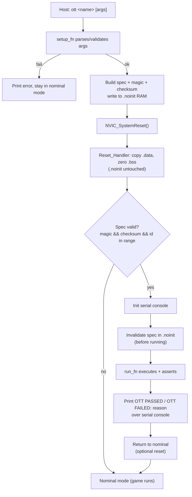

# 9 OTT Mechanism & Reset Flow

[← Back to Index](Index.md) · See also [03 Architecture §3.7 OTT CLI Framework](03-Architecture.md#37-on-target-test-ott-cli-framework) · [06 Verification & Validation](06-Verification-and-Validation.md)

This document records how the On-Target Test (OTT) mechanism is actually implemented in the project owner's reference firmware, [BareMetalHollowClockFw](https://github.com/MaxLell/BareMetalHollowClockFw), and derives a **corrected, validated reset flow** for MicroPacControllerMan to adopt. It is the verification backing for the OTT framework summarised in [03 Architecture §3.7](03-Architecture.md#37-on-target-test-ott-cli-framework); it exists because a proposed 7-step OTT flow needed checking against the real source before being turned into an architecture diagram.

> **Reference-target caveat:** BareMetalHollowClockFw runs on an **STM32U083 (Cortex-M0+)** over **SEGGER RTT**, not on an STM32G431 (Cortex-M4) over the STLINK serial console. The reset/retained-RAM reasoning below applies to both parts; where the transport or MCU matters, it is called out. FR-107 (PASS/FAIL over the serial console, no debugger required) makes one part of the reference design unsuitable to copy verbatim — see [§9.5](#95-divergences-for-this-project).

## 9.1 How the reference firmware actually works

Verified against the real source (`Test/Target/ott.c`, `Bsp/retain_ram/retain_ram.c`, `App/main.c`, `App/app/app.c`, `Drivers/system/system.c`, `ThirdParty/STM32U083/*.ld` and `*.S`):

- **Transport / UI.** The CLI (`MaxLell/EmbeddedCli`) runs over SEGGER RTT (`Bsp/console_bsp/console_bsp.c`). The command is `ott <name> [args…]`; with no/invalid argument it lists the available scenarios.
- **Scheduling.** `ott_cli_cmd → ott_setup_and_trigger_test` resolves the name to a `test_id`, runs the scenario's `setup_fn` (which fills a parameter buffer from the CLI args), then writes an `ott_spec_t {u32 test_id; u8 data[…]; u32 data_size;}` — sized to exactly fill a 32-byte retained buffer — into a **retained RAM** region, and requests a reset.
- **Retained RAM.** A single static buffer is placed in a no-init section: `__attribute__((section(".noinit"), used, aligned(4)))`. Read/write are plain `memcpy` wrappers.
- **Reset.** `system_reset_microcontroller()` calls CMSIS `NVIC_SystemReset()` (i.e. `SCB->AIRCR` `SYSRESETREQ`).
- **Boot decision (`main`).** `ott_shall_tests_be_executed()` reads the spec from `.noinit`; if `E_OTT_SCENARIO_NONE < test_id < E_OTT_SCENARIO_LAST` it enters test mode (`ott_init(); ott_execute_test();`), otherwise it runs the normal app.
- **Execution.** `ott_execute_test()` reads the spec, looks up the scenario's `run_fn`, runs it, **clears the spec in `.noinit`**, then calls `NVIC_SystemReset()` again to return to nominal mode.
- **Reporting — the key finding.** The scenario `run` functions **print nothing on success**. A pass is silent; the board just resets back into nominal mode. A fail is an `ASSERT` whose handler executes `bkpt #0` and spins — i.e. the report is a **debugger halt at the failing line**, visible only under J-Link. The `OTT PASSED [<name>]` strings exist **only in file-header comments; no code emits them.** Additionally, the test-execution branch of `main()` does **not** call `app_init()`, so RTT is never even initialised in test mode — reinforcing that the intended report is the debugger breakpoint, not a console message.

## 9.2 The proposed 7-step flow, verified

| # | Proposed step | Verdict |
|---|---|---|
| 1 | CLI command selects the next test | ✅ Correct (`ott <name> [args]`). |
| 2 | Store selection in RAM not cleared by reset | ✅ Correct (`.noinit` retained RAM). |
| 3 | System reset | ✅ Correct (`NVIC_SystemReset`). |
| 4 | After reset, read retained mem; if present, run the test | ✅ Correct — **but** "present" is only a range check on `test_id`, with **no integrity guard**. |
| 5 | Test executes | ✅ Correct. |
| 6 | Retained memory cleared; location defined in the linker script | ✅ Correct — cleared *before* the reset; the `.noinit` region is defined in the `.ld`. |
| 7 | System resets again **and a report is given** | ❌ **Wrong on the report.** The second reset happens, but only to return to nominal mode. **No report is produced by or after that reset.** Any report must be emitted *during* step 5, before the reset. In the reference, success is silent and failure is a debugger halt. |

**Conclusion:** the structure is right; only step 7's "a report is given" is incorrect. The second reset is a *return-to-nominal* action, not a reporting action.

## 9.3 Technical basis (Cortex-M / STM32G431)

**Does SRAM survive a software reset?** **Yes.** `SYSRESETREQ` resets the core and peripherals and re-runs the reset handler, but it does not clear SRAM — the cells keep their values as long as V<sub>DD</sub> stays in range. The same holds for watchdog and NRST-pin resets. SRAM contents are lost/undefined only when the supply actually drops or the RAM is depowered:

- **Power-on reset (POR)** — cold boot; `.noinit` holds garbage.
- **Brown-out reset (BOR)** / any V<sub>DD</sub> dip below the data-retention voltage.
- **Standby low-power mode** where the SRAM domain is powered down (on STM32G4, main SRAM loses state in Standby; only a retained domain / RTC backup registers survive).
- First boot after flashing, or a debugger-driven full power cycle.

**Defining the no-init section (GCC).** Add a `NOLOAD` output section in the RAM region, kept out of the `.data`/`.bss` ranges:

```ld
.noinit (NOLOAD) : ALIGN(4)
{
    . = ALIGN(4);
    __noinit_start__ = .;
    *(.noinit)
    *(.noinit*)
    . = ALIGN(4);
    __noinit_end__ = .;
} >RAM
```

`(NOLOAD)` reserves the addresses but places nothing in flash and copies nothing at load. Place the C object with `__attribute__((section(".noinit")))`.

**Adjusting startup.** The reset handler must simply **not touch** that range. In the reference `startup` it copies `.data` (`_sdata…_edata` from `_sidata`) and zero-fills **only** `.bss` (`_sbss…_ebss`); it never references `__noinit_start__/__noinit_end__`. Because `.noinit` is laid out after `.bss`, the zero-fill loop stops at `_ebss` and leaves `.noinit` intact. No extra startup code is needed — the only requirement is that `.bss` does not overlap `.noinit`.

## 9.4 What is fragile or unnecessary

1. **No validity guard on the retained data (most important).** Validity is decided purely by `test_id ∈ (NONE, LAST)`. After a cold/POR boot, `.noinit` holds garbage; if that garbage `test_id` happens to fall in the valid enum range, the board silently boots into an unintended test. The reference even *declares* a `RETAIN_RAM_CANARY_BYTE (0xA5)` but never uses it. **Fix:** store a **magic word** plus a **checksum/CRC** with the spec, and run a test only if magic matches **and** checksum verifies **and** `test_id` is in range.
2. **The second reset is not needed for reporting**, and is arguably not needed at all. Its only effect is to re-enter nominal mode with a clean `.noinit`. The same is achievable by clearing the spec and simply returning from the test path into nominal init. A report can and should be printed directly, before any reset.
3. **Guard the assert path.** `bkpt #0` with no debugger attached escalates to a fault/hang on Cortex-M. For this project (FR-107), failures must be reported over the serial console rather than relying on a breakpoint.

## 9.5 Divergences for this project

MicroPacControllerMan must **not** copy the reference's silent/debugger-halt reporting, because FR-107 (see [02 Requirements](02-Requirements.md)) requires PASS/FAIL (with reason on failure) on the serial console **without a debugger attached**, and NFR-104 requires the result to be machine-parseable by the Python harness. Concretely, this project shall:

- Print `OTT PASSED [<name>]` / `OTT FAILED [<name>]: <reason>` over the STLINK serial console **from within the run step**, before returning.
- Initialise the console transport on the test-execution path (the reference skips app init in test mode).
- Add a **magic word + checksum** to the retained spec and validate it on boot.
- Treat the post-test reset as an optional *return-to-nominal* step, not a reporting step.

## 9.6 Corrected flow (for reference and diagram)

**A. Schedule** (host issues `ott <name> [args]` over the serial console)
1. Parse the command; resolve `<name>` → `test_id`. Unknown → print available tests and stop.
2. Run the scenario `setup_fn` to populate the parameter buffer. Failure → print "failed to schedule" and stop.
3. Build the spec `{test_id, data, data_size}` **plus a magic word and checksum/CRC**.
4. Write the spec into the `.noinit` retained RAM buffer.
5. Print "scheduled, resetting…" and trigger `NVIC_SystemReset()`.

**B. Boot decision** (every reset: `Reset_Handler` → `main`)
6. Startup copies `.data`, zero-fills `.bss`, leaves `.noinit` untouched.
7. Read the retained spec. **Valid** = magic matches **and** checksum verifies **and** `test_id` in range.
   - Invalid → nominal mode (normal app / game). Handles cold-boot garbage correctly.
   - Valid → test mode.

**C. Execute + report** (test mode)
8. Initialise the serial console so results can be printed.
9. **Invalidate the spec immediately** (clear magic / zero the buffer) *before* running, so a crash mid-test cannot loop-boot into the same test.
10. Look up and call the scenario `run_fn(data, data_size)`; it asserts/checks internally and prints `OTT PASSED […]` or `OTT FAILED […]: <reason>` over the console. **The report happens here, before any reset.**
11. Return to nominal mode — either one `NVIC_SystemReset()` (spec already invalidated) or fall through into nominal init. **No second reset is required to report.**



## 9.7 Status

Produced during Pre-Planning as verification input for [03 Architecture §3.7](03-Architecture.md#37-on-target-test-ott-cli-framework). The reference-firmware behaviour is confirmed against source; the corrected flow of [§9.6](#96-corrected-flow-for-reference-and-diagram) was **implemented and validated on STM32G431 hardware during [Milestone 1](04-Implementation-Phases-and-Milestones.md)** (brought forward from Board Bring-Up): `ott blinky` schedules via the `.noinit` retained buffer (magic word + checksum guard, §9.4/§9.5), resets, and on the next boot invalidates the request, runs the scenario, and prints `OTT PASSED [blinky]` over the STLINK serial console — driven end-to-end by `Test/run_ott.py`. The firmware mirrors the reference project's layout — the OTT core + registry under `Test/Target/`, each scenario as its own module under `Test/Target/scripts/`, and the retained-RAM buffer as BSP-level code outside `Test/`. The implementation falls through into nominal mode after reporting (no second reset), per step 11.
